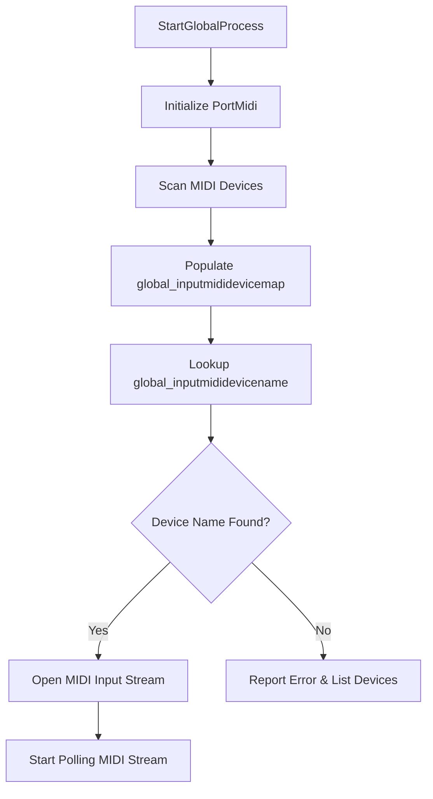

# Audio Device and MIDI Device Configuration

This section explains how the application configures both audio and MIDI devices, focusing on **MIDI Device Mapping and Selection**. The MIDI subsystem relies on global maps to match device names (e.g., “Q49” or a MIDI Yoke port) to their numeric PortMidi indices. Once a device is selected, a `PmStream` is opened for reading incoming MIDI events.

## 🎹 MIDI Device Mapping and Selection

The MIDI mapping and selection process lets users specify a preferred input device by name. The application then:

- **Scans** all available MIDI input devices via PortMidi.
- **Populates** `global_inputmididevicemap` with name→index pairs.
- **Looks up** the configured `global_inputmididevicename` in this map.
- **Opens** the matching device for input streaming.
- **Reports** errors or lists available ports if no match is found.

### Global MIDI Configuration Variables

Key globals declared in `spiregreadwrite.cpp`:

| Variable | Type | Default | Purpose |
| --- | --- | --- | --- |
| **global_inputmididevicemap** | `std::map<string,int>` | empty | Maps device names to PortMidi IDs. |
| **global_inputmididevicename** | `string` | `"Q49"` | User-configured MIDI input device name. |
| **global_inputmidideviceid** | `int` | `11` | PortMidi device ID selected for input. |
| **global_pPmStreamMIDIIN** | `PmStream*` | `nullptr` | Handle for the opened MIDI input stream. |
| **global_active** | `bool` | `false` | Becomes `true` when MIDI stream is ready. |
| **global_inited** | `bool` | `false` | Suppresses status output during parsing. |


### Process Flow



### MIDI Device Scanning and Mapping

Upon application start, `StartGlobalProcess` initializes PortMidi and scans for available input ports:

```cpp
PmError err;
err = Pm_Initialize();  // Initialize PortMidi library
int numDevices = Pm_CountDevices();
for (int i = 0; i < numDevices; i++) {
    const PmDeviceInfo* info = Pm_GetDeviceInfo(i);
    if (info->input) {
        // Map device name to its numeric ID
        global_inputmididevicemap.emplace(info->name, i);
    }
}
// At end: global_inputmididevicemap contains all input devices 
```

### MIDI Device Selection

The system then attempts to match the user-specified name:

```cpp
auto it = global_inputmididevicemap.find(global_inputmididevicename);
if (it != global_inputmididevicemap.end()) {
    // Match found: retrieve and log the ID
    global_inputmidideviceid = it->second;
    StatusAddTextA(
      (global_inputmididevicename + " maps to " +
       std::to_string(global_inputmidideviceid) + "\n").c_str()
    );
} else {
    // No match: assert and list available devices
    assert(false);
    for (auto& kv : global_inputmididevicemap) {
        StatusAddTextA((kv.first + " maps to " +
                        std::to_string(kv.second) + "\n").c_str());
    }
    StatusAddText(L"input midi device not found\n");
    return;
} 
```

- **Success path**: stores the matched ID in `global_inputmidideviceid`.
- **Failure path**: triggers an assertion, lists all detected ports, and aborts initialization.

### Opening MIDI Input Stream

Once a valid device ID is determined, the application opens the PortMidi input stream and starts polling:

```cpp
err = Pm_OpenInput(
  &global_pPmStreamMIDIIN,
  global_inputmidideviceid,
  nullptr,    // no stream parameters
  512,        // buffer size
  nullptr,
  nullptr
);
if (err != pmNoError) {
    StatusAddTextA(Pm_GetErrorText(err));
    Pt_Stop();  // stop PortTime callbacks
    return;
}
Pm_SetFilter(global_pPmStreamMIDIIN, filter); // Apply any MIDI filtering
Pt_Start(1, receive_poll, 0);                 // Begin polling callbacks
global_inited = true;
global_active = true; // MIDI subsystem is now operational 
```

### Error Handling and User Guidance

- If **no matching device** is found, the app asserts and prints a list of detected MIDI ports.
- The **user must** either adjust the `global_inputmididevicename` argument or reconfigure virtual MIDI ports in the OS.
- Any failure to open the stream results in status messages via `StatusAddText*` and clean shutdown of the MIDI subsystem.

---

This mapping and selection mechanism ensures that the synthesizer reliably connects to the user’s desired MIDI input, whether it be a hardware controller like the Alesis Q49 or virtual ports such as MIDI Yoke.