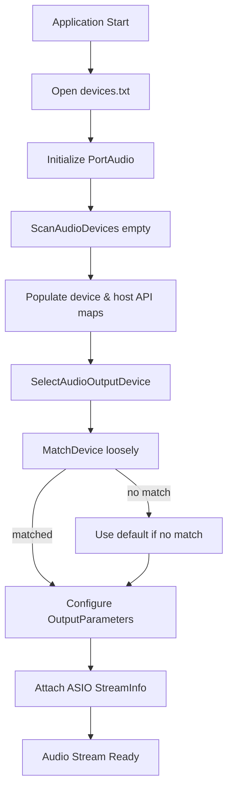

# Audio Device and MIDI Device Configuration – Scanning and Selecting Audio Devices

This section explains how the synthesizer discovers available PortAudio devices at startup, logs their details, and selects the appropriate audio output device. The process builds lookup maps for input and output devices and configures stream parameters—including ASIO-specific settings when needed.

## 🎛️ Scanning Audio Devices

The scanning routine runs once at startup. It:

- Opens a log file (`devices.txt`) for writing.
- Calls `Pa_Initialize()` to start PortAudio.
- Invokes `ScanAudioDevices()` with an empty match mode to:
- **Clear** and **repopulate** all maps:
- `global_alldevicemap` – ID → name for every device
- `global_inputdevicemap` – ID → name for input-capable devices
- `global_outputdevicemap` – ID → name for output-capable devices
- `global_hostapimap` and per-API maps (`global_hostapimap_asio`, etc.) – host API type → device names
- **Log** each device’s ID, host API, and name (plus channel counts and latencies when detailed logging is enabled).

```cpp
int SPIAudioDevice::ScanAudioDevices(string matchmode, spiaudiodevicetypeflag ioflag) {
    // Clear maps when called with empty matchmode
    if (matchmode.empty()) {
        global_alldevicemap.clear();
        global_inputdevicemap.clear();
        global_outputdevicemap.clear();
        global_hostapimap.clear();
        // Initialize host API name→type map...
        const PaDeviceInfo* deviceInfo;
        int numDevices = Pa_GetDeviceCount();
        for (int i = 0; i < numDevices; i++) {
            deviceInfo = Pa_GetDeviceInfo(i);
            string name = deviceInfo->name;
            global_alldevicemap.insert({i, name});
            if (deviceInfo->maxInputChannels > 0)
                global_inputdevicemap.insert({i, name});
            if (deviceInfo->maxOutputChannels > 0)
                global_outputdevicemap.insert({i, name});
            const PaHostApiInfo* hostInfo = Pa_GetHostApiInfo(deviceInfo->hostApi);
            string apiName = hostInfo->name;
            global_hostapimap.insert({i, apiName});
            // Populate per-API maps: asio, directsound, MME, WDMKS, JACK, WASAPI...
            if (m_pFILE)
                fprintf(m_pFILE,
                        "id=%d, hostapi=%s, devicename=%s\n",
                        i, apiName.c_str(), name.c_str());
        }
    }
    return paNoDevice;  // Matching logic omitted for brevity
}
```

Citation

**Maps Overview**

| Map Name | Description |
| --- | --- |
| global_alldevicemap | All PortAudio device IDs → names |
| global_inputdevicemap | IDs → names for devices with input channels |
| global_outputdevicemap | IDs → names for devices with output channels |
| global_hostapimap | Device ID → host API name |
| global_hostapimap_asio | ASIO devices → names (for ASIO-specific selection) |
| global_hostapimap_wdmks | WDM-KS devices → names |
| (etc.) | … |


## 🔌 Selecting Audio Output Device

After scanning, `SelectAudioOutputDevice()` chooses the output device based on a user-configured name (`global_audiooutputdevicename`). If no match is found, it falls back to PortAudio’s default output device.

1. **Ensure maps are populated**

If `global_outputdevicemap` is empty, call `ScanAudioDevices()`.

1. **Match device name**

Call `ScanAudioDevices("loosely", spiaudiodeviceOUTPUT)` to perform fuzzy matching against `global_audiooutputdevicename`.

1. **Fallback**

If matching returns `paNoDevice`, return `false` to indicate selection failure.

1. **Configure **`**PaStreamParameters**`
2. **device**: matched or default device ID
3. **channelCount**: `global_numchannels`
4. **sampleFormat**: `PA_SAMPLE_TYPE` (e.g., `paFloat32`)
5. **suggestedLatency**: `Pa_GetDeviceInfo(device)->defaultLowOutputLatency`

1. **ASIO-specific setup**

If the device’s host API type is `paASIO`, populate a `PaAsioStreamInfo` and attach it; otherwise, leave `hostApiSpecificStreamInfo` **NULL**.

```cpp
bool SPIAudioDevice::SelectAudioOutputDevice() {
    // Populate maps on first call
    if (global_outputdevicemap.empty()) {
        ScanAudioDevices();
    }
    // Fuzzy match configured name
    int deviceid = ScanAudioDevices("loosely", spiaudiodeviceOUTPUT);
    if (deviceid == paNoDevice) {
        return false;
    }

    // Core stream parameters
    global_outputParameters.device        = deviceid;
    global_outputParameters.channelCount  = global_numchannels;
    global_outputParameters.sampleFormat  = PA_SAMPLE_TYPE;
    global_outputParameters.suggestedLatency =
        Pa_GetDeviceInfo(deviceid)->defaultLowOutputLatency;

    // ASIO configuration (non-portable)
    global_asioOutputInfo.size             = sizeof(PaAsioStreamInfo);
    global_asioOutputInfo.hostApiType      = paASIO;
    global_asioOutputInfo.version          = 1;
    global_asioOutputInfo.flags            = paAsioUseChannelSelectors;
    global_asioOutputInfo.channelSelectors = global_outputAudioChannelSelectors;

    // Attach ASIO info only for ASIO devices
    PaHostApiTypeId apiType =
        Pa_GetHostApiInfo(Pa_GetDeviceInfo(deviceid)->hostApi)->type;
    if (apiType == paASIO) {
        global_outputParameters.hostApiSpecificStreamInfo =
            &global_asioOutputInfo;
    } else {
        global_outputParameters.hostApiSpecificStreamInfo = NULL;
    }
    return true;
}
```

Citation

**Output Parameters Summary**

| Parameter | Value / Source |
| --- | --- |
| **device** | Matched or default PortAudio device ID |
| **channelCount** | `global_numchannels` |
| **sampleFormat** | `PA_SAMPLE_TYPE` (e.g., `paFloat32`) |
| **suggestedLatency** | `deviceInfo->defaultLowOutputLatency` |
| **hostApiSpecificStreamInfo** | `&global_asioOutputInfo` (ASIO) or `NULL` |


## Process Flow Overview



This flowchart illustrates the end-to-end logic from application start through audio output device selection.

---

*Note: Audio input selection follows a similar pattern using `global_inputdevicemap` and `global_inputParameters`.*