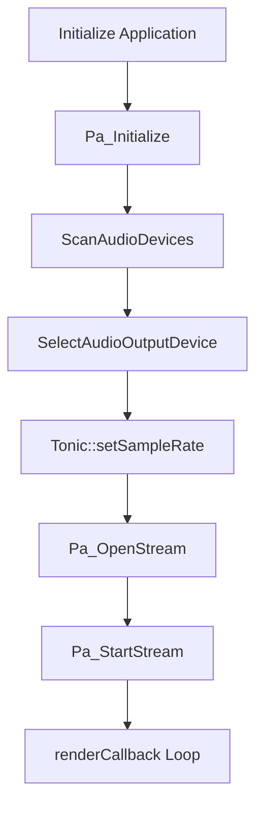

# Audio and MIDI Engine Architecture – Audio I/O via PortAudio and ASIO

This section describes how the application handles audio input and output using PortAudio, including optional ASIO support. It covers device discovery, parameter configuration, stream setup, and the real-time audio callback that feeds the Tonic synth.

## SPIAudioDevice Class 📦

The `SPIAudioDevice` class encapsulates all PortAudio device management and stream configuration. It maintains maps of available devices, host APIs, and the global `PaStreamParameters` used when opening the audio stream.

```cpp
class SPIAudioDevice {
public:
  std::map<int, string> global_alldevicemap;
  std::map<int, string> global_inputdevicemap;
  std::map<int, string> global_outputdevicemap;
  // Host API maps...
  PaStream* global_stream;
  PaStreamParameters global_inputParameters;
  PaStreamParameters global_outputParameters;
  PaAsioStreamInfo global_asioInputInfo;
  PaAsioStreamInfo global_asioOutputInfo;
  string global_audiooutputdevicename;
  int global_outputAudioChannelSelectors[2];

  SPIAudioDevice();
  ~SPIAudioDevice();

  int ScanAudioDevices(string matchmode = "", spiaudiodevicetypeflag ioflag = spiaudiodeviceALL);
  bool SelectAudioOutputDevice();
  bool SelectAudioInputDevice();
  string GetHostAPIName(int deviceid);
  string GetDeviceName(int deviceid);
};
```

Every method returns success/failure or device IDs, while populating the global maps and parameter structs .

## Device Discovery and Mapping 🔍

`ScanAudioDevices` iterates all PortAudio devices, classifies them by host API and direction, and fills maps for later lookup.

- Populates:
- `global_alldevicemap`: all devices
- `global_inputdevicemap` / `global_outputdevicemap`
- `global_hostapimap_asio`, etc.

- Uses `Pa_GetDeviceCount()` and `Pa_GetDeviceInfo(i)`

```cpp
int SPIAudioDevice::ScanAudioDevices(...)
{
  global_alldevicemap.clear();
  global_inputdevicemap.clear();
  global_outputdevicemap.clear();
  // ...
  int numDevices = Pa_GetDeviceCount();
  for (int i = 0; i < numDevices; i++) {
    const PaDeviceInfo* info = Pa_GetDeviceInfo(i);
    string name = info->name;
    global_alldevicemap[i] = name;
    if (info->maxOutputChannels > 0)
      global_outputdevicemap[i] = name;
    // classify by host API
  }
  return paNoError;
}
```

This mapping supports loose matching of user-supplied device names or default selection .

## Selecting the Output Device 🎯

`SelectAudioOutputDevice` chooses the audio output device by:

1. **Scanning** if maps are empty.
2. **Matching** `global_audiooutputdevicename` to a device ID or falling back to the default.
3. **Configuring** `global_outputParameters`:

| Field | Description |
| --- | --- |
| `device` | Device index |
| `channelCount` | Number of channels (e.g., `NUM_CHANNELS`) |
| `sampleFormat` | Sample type macro (`PA_SAMPLE_TYPE`, usually `paFloat32`) |
| `suggestedLatency` | Device’s default low output latency |
| `hostApiSpecificStreamInfo` | Pointer to ASIO info or `NULL` |


```cpp
bool SPIAudioDevice::SelectAudioOutputDevice() {
  int deviceid = ScanAudioDevices("loosely", spiaudiodeviceOUTPUT);
  if (deviceid == paNoDevice) return false;

  global_outputParameters.device = deviceid;
  global_outputParameters.channelCount = NUM_CHANNELS;
  global_outputParameters.sampleFormat = PA_SAMPLE_TYPE;
  global_outputParameters.suggestedLatency =
    Pa_GetDeviceInfo(deviceid)->defaultLowOutputLatency;

  // ASIO-specific setup
  global_asioOutputInfo.size = sizeof(PaAsioStreamInfo);
  global_asioOutputInfo.hostApiType = paASIO;
  global_asioOutputInfo.version = 1;
  global_asioOutputInfo.flags = paAsioUseChannelSelectors;
  global_asioOutputInfo.channelSelectors = global_outputAudioChannelSelectors;

  if (Pa_GetHostApiInfo(Pa_GetDeviceInfo(deviceid)->hostApi)->type == paASIO)
    global_outputParameters.hostApiSpecificStreamInfo = &global_asioOutputInfo;
  else
    global_outputParameters.hostApiSpecificStreamInfo = NULL;

  return true;
}
```

This logic ensures ASIO devices use channel selectors for precise I/O routing, while other APIs omit the extra info .

```card
{
    "title": "ASIO PortAudio Note",
    "content": "ASIO stream info is not portable; it only applies when the host API is ASIO."
}
```

## Opening and Starting the Audio Stream 🚀

Once parameters are set, the application opens and starts the PortAudio stream:

```cpp
// Setup Tonic sample rate (default 44100 Hz)
Tonic::setSampleRate(SAMPLE_RATE);

// Open stream: output-only (NULL for input parameters)
global_err = Pa_OpenStream(
  &global_stream,
  NULL,
  &global_outputParameters,
  SAMPLE_RATE,
  FRAMES_PER_BUFFER,
  paClipOff,
  renderCallback,
  NULL
);
if (global_err != paNoError) { /* error handling */ }

global_err = Pa_StartStream(global_stream);
if (global_err != paNoError) { /* error handling */ }
```

- **Sample rate** and **buffer size** are macros (`SAMPLE_RATE`, `FRAMES_PER_BUFFER`).
- `paClipOff` disables automatic clipping for out-of-range samples.
- `renderCallback` supplies audio each buffer cycle .

## Real-Time Audio Callback 🔄

The `renderCallback` function is called by PortAudio at interrupt level to fill the output buffer:

```cpp
static int renderCallback(
  const void* inputBuffer,
  void* outputBuffer,
  unsigned long framesPerBuffer,
  const PaStreamCallbackTimeInfo* timeInfo,
  PaStreamCallbackFlags statusFlags,
  void* userData
) {
  (void)inputBuffer; (void)timeInfo; (void)statusFlags; (void)userData;
  if (global_abort) return paAbort;

  // Pull audio from Tonic synth
  synth.fillBufferOfFloats(
    (float*)outputBuffer,
    framesPerBuffer,
    NUM_CHANNELS
  );

  // Copy for spectrum display
  audiobuffer_ready = false;
  memcpy(audiobuffer, outputBuffer,
         sizeof(float) * framesPerBuffer * NUM_CHANNELS);
  audiobuffer_ready = true;

  return paContinue;
}
```

- **Avoids** dynamic memory calls (no `malloc`/`free`).
- Uses pre-allocated `audiobuffer` for spectrum analysis .

## Initialization Flowchart



## Summary

- **Device discovery** populates maps of all PortAudio devices by API and direction.
- **Parameter configuration** sets device indices, channel counts, sample format, latencies, and ASIO-specific info.
- **Stream setup** uses `Pa_OpenStream` and `Pa_StartStream` to drive the audio engine.
- **Callback function** fetches audio from the Tonic synthesizer and deposits it into the output buffer with minimal overhead.

This architecture ensures low-latency, flexible audio I/O with full support for high-performance ASIO drivers and real-time synthesis.