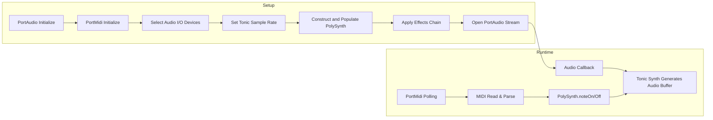

# Audio and MIDI Engine Architecture – High-Level Signal Flow

This section describes the core audio and MIDI engine of the Windows desktop MIDI-driven polyphonic synthesizer. It covers initialization, device setup, Tonic sample rate configuration, synth construction, audio streaming, and MIDI event handling.

## Initialization Phase

The application bootstraps its audio and MIDI subsystems before entering the main event loop.

- **PortAudio Initialization**

Calls `Pa_Initialize()` to prepare the audio I/O layer.

- **PortMidi Initialization**

Calls `Pm_Initialize()` to prepare MIDI I/O via PortMidi .

- **SPIAudioDevice Setup**

Uses `SPIAudioDevice` to wrap PortAudio device enumeration and selection .

## Device Selection

After initializing subsystems, the engine chooses the best-fit audio input/output devices.

- **Scan Audio Devices**

Populates device lists via `SPIAudioDevice::ScanAudioDevices()`.

- **Select Audio Output**

Calls `SelectAudioOutputDevice()` to set `global_outputParameters` with chosen device ID and channel count .

- (Optionally) **Select Audio Input**

Similar flow for input—used in spectrum analysis.

## Tonic Sample Rate Configuration

Sets Tonic’s global sample rate to match the audio stream:

```cpp
Tonic::setSampleRate(SAMPLE_RATE);
```

Defaults to 44 100 Hz if omitted .

## Synth Construction Phase 🎛️

Builds the polyphonic synthesizer and attaches optional effects.

### PolySynth and Voice Allocation

- **PolySynth Instance**

`PolySynth` is a `Synth` subclass using `LowestNoteStealingPolyphonicAllocator` for voice management .

- **Adding Voices**

```cpp
  poly.addVoices(createSynthVoice, voiceCount);
```

Each voice is a Tonic `Synth` generated by `createSynthVoice()` .

### Effects Chain

Chains stereo effects using Tonic’s `>>` operator:

```cpp
auto delay = StereoDelay(3.0f, 3.0f)
    .delayTimeLeft(0.25 + SineWave().freq(0.2) * 0.01)
    .delayTimeRight(0.30 + SineWave().freq(0.23) * 0.01)
    .feedback(0.4)
    .dryLevel(0.8)
    .wetLevel(0.2);

synth.setOutputGen(poly >> delay);
```

This routes the polyphonic mixer into a stereo delay before output .

## Audio Stream Setup 🔊

Opens and starts the PortAudio stream for real-time audio.

| Parameter | Value |
| --- | --- |
| Sample rate | `SAMPLE_RATE` |
| Frames per buffer | `FRAMES_PER_BUFFER` |
| Channels | `NUM_CHANNELS` |
| Stream callback | `renderCallback` |
| Stream flags | `paClipOff` |


```cpp
mySPIAudioDevice.global_err = Pa_OpenStream(
    &mySPIAudioDevice.global_stream,
    NULL,
    &mySPIAudioDevice.global_outputParameters,
    SAMPLE_RATE,
    FRAMES_PER_BUFFER,
    paClipOff,
    renderCallback,
    NULL
);
// Error handling omitted…
Pa_StartStream(mySPIAudioDevice.global_stream);
```

This handshake ties PortAudio’s callback into our synth engine .

## Runtime Processing

### Audio Callback

On each buffer, PortAudio invokes `renderCallback`, which delegates to Tonic:

```cpp
static int renderCallback(const void*   inputBuffer,
                          void*         outputBuffer,
                          unsigned long framesPerBuffer,
                          const PaStreamCallbackTimeInfo* timeInfo,
                          PaStreamCallbackFlags statusFlags,
                          void* userData)
{
    auto* out = static_cast<float*>(outputBuffer);
    synth.fillBufferOfFloats(out, framesPerBuffer, NUM_CHANNELS);
    return paContinue;
}
```

This generates interleaved stereo samples from the current synth graph .

### MIDI Input Handling 🎹

MIDI events drive note on/off messages into the polyphonic engine.

1. **Open MIDI Stream**

```cpp
   Pm_OpenInput(&global_pPmStreamMIDIIN,
                global_inputmidideviceid,
                NULL,
                512,
                NULL,
                NULL);
   Pm_SetFilter(global_pPmStreamMIDIIN, filter);
```

1. **PortTime Polling**

Uses `Pt_Start(1, receive_poll, 0)` to call `receive_poll` every millisecond .

1. **Event Dispatch**

```cpp
   void receive_poll(...)
   {
     PmEvent event;
     while (Pm_Read(global_pPmStreamMIDIIN, &event, 1) == 1) {
       int cmd = Pm_MessageStatus(event.message) & MIDI_CODE_MASK;
       int note = Pm_MessageData1(event.message);
       int vel  = Pm_MessageData2(event.message);
       if (cmd == MIDI_ON_NOTE)
         poly.noteOn(note, vel);
       else if (cmd == MIDI_OFF_NOTE)
         poly.noteOff(note);
     }
   }
```

Each MIDI note-on/off is routed to `PolySynth` for voice allocation .

## High-Level Signal Flow Diagram



## Key Components Overview

| Component | Responsibility |
| --- | --- |
| SPIAudioDevice | Wraps PortAudio initialization and device selection |
| Tonic::setSampleRate | Configures global sample rate for all Tonic synths |
| PolySynth | Manages polyphony via voice stealing allocator |
| createSynthVoice | Defines a single voice (oscillators, envelopes, filters) |
| StereoDelay/Reverb | Post-processing effects injected into synth graph |
| renderCallback | PortAudio callback feeding audio buffer |
| PortMidi + PortTime | MIDI I/O: open, filter, poll, dispatch note events |


---

```card
{
    "title": "Note Stealing",
    "content": "PolySynth uses LowestNoteStealingPolyphonicAllocator to reassign voices when all are active."
}
```

This completes the high-level overview of how the application wires together PortAudio, PortMidi, and Tonic to realize a responsive, polyphonic MIDI-controlled synthesizer with real-time audio effects.