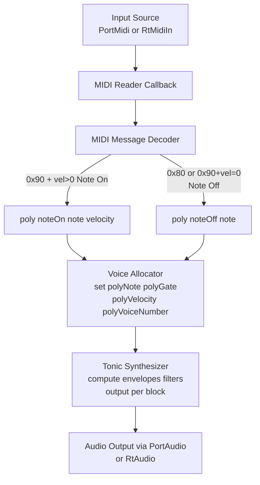

# Audio and MIDI Engine Architecture

This section delves into the MIDI Processing Flow within the Windows desktop MIDI-driven polyphonic synthesizer and spectrum-related audio tool. It describes how incoming MIDI messages travel from the hardware or virtual port, through decoding logic, to voice allocation and synthesis via the Tonic library.

## MIDI Processing Flow Overview

The MIDI Processing Flow handles real-time note events, converting raw MIDI bytes into high-level synth actions.

- 🎹 **Input Sources**: PortMidi’s `PmStream` or RtMidi’s `RtMidiIn`
- ⚙️ **Decoder**: Extracts channel, message type, note number, and velocity
- 🎶 **Voice Control**: Calls **poly.noteOn** or **poly.noteOff**
- 🔊 **Tonic Synthesis**: Updates voice parameters for envelope, filter, and output



## MIDI Reader Callback

The callback function interfaces with the MIDI API to receive messages. It extracts status bytes and decides between note-on and note-off events.

```cpp
void midiCallback(double deltatime,
                  vector<unsigned char>* msg,
                  void* userData) {
    int chan    = (*msg)[0] & 0x0f;
    int msgtype = (*msg)[0] & 0xf0;
    int note    = (*msg)[1];
    int vel     = (*msg)[2];

    // Note Off: either explicit 0x80 or 0x90 with velocity zero
    if (msgtype == 0x80 || (msgtype == 0x90 && vel == 0)) {
        std::cout << "MIDI Note OFF  C: " << chan
                  << " N: " << note << std::endl;
        poly.noteOff(note);
    }
    // Note On
    else if (msgtype == 0x90) {
        std::cout << "MIDI Note ON   C: " << chan
                  << " N: " << note
                  << " V: " << vel << std::endl;
        poly.noteOn(note, vel);
    }
}
```

– Extracted from the RtMidi example using `RtMidiIn`

## Message Decoder and Command Mapping

| Hex Code | Description | Action |
| --- | --- | --- |
| 0x90 | Note On | `poly.noteOn(note, vel)` |
| 0x80 | Note Off | `poly.noteOff(note)` |
| 0x90+vel=0 | Note Off | `poly.noteOff(note)` |


- **Channel** is `(status & 0x0f)`
- **Message Type** is `(status & 0xf0)`
- **Note Number** = data byte 1
- **Velocity** = data byte 2

## PolySynth Voice Allocation

The `PolySynth` class uses a templated allocator to manage multiple voices. Incoming note events invoke:

- **noteOn(note, velocity)**
- **noteOff(note)**

```cpp
template<typename VoiceAllocator>
class PolySynthWithAllocator : public Synth {
public:
    void noteOn(int note, int velocity) {
        allocator.noteOn(note, velocity);
    }
    void noteOff(int note) {
        allocator.noteOff(note);
    }
protected:
    Mixer      mixer;
    VoiceAllocator allocator;
};
typedef PolySynthWithAllocator<LowestNoteStealingPolyphonicAllocator> PolySynth;
```

– Definition of `PolySynth` and its allocator

### Handling Note On

When a note-on event occurs, the allocator:

1. Selects an available or stealing voice
2. Sets synthesizer parameters

```cpp
void BasicPolyphonicAllocator::noteOn(int note, int velocity) {
    int voiceNumber = getNextVoice(note);
    if (voiceNumber < 0) return; // no voice available

    PolyVoice& v = voiceData[voiceNumber];
    v.synth.setParameter("polyNote", note);
    v.synth.setParameter("polyGate", 1.0);
    v.synth.setParameter("polyVelocity", velocity);
    v.synth.setParameter("polyVoiceNumber", voiceNumber);
    v.currentNote = note;

    activeVoiceQueue.remove(voiceNumber);
    activeVoiceQueue.push_back(voiceNumber);
    inactiveVoiceQueue.remove(voiceNumber);
}
```

– Implementation in `BasicPolyphonicAllocator`

### Handling Note Off

On note-off, the allocator clears the gate for the matching voice:

```cpp
void BasicPolyphonicAllocator::noteOff(int note) {
    for (int voiceNumber : activeVoiceQueue) {
        PolyVoice& v = voiceData[voiceNumber];
        if (v.currentNote == note) {
            v.synth.setParameter("polyGate", 0.0);
            activeVoiceQueue.remove(voiceNumber);
            inactiveVoiceQueue.push_back(voiceNumber);
            break;
        }
    }
}
```

– Releases the voice and returns it to the inactive pool

## Voice Parameter Updates

Each voice’s **Tonic** synthesizer graph listens to these control parameters:

| Parameter Name | Role |
| --- | --- |
| **polyNote** | MIDI note number |
| **polyGate** | Gate trigger for ADSR |
| **polyVelocity** | Controls amplitude/envelope |
| **polyVoiceNumber** | Used for detune or panning |


ControlGenerators within Tonic use these to compute oscillators, envelopes, and filters each audio block.

## Integration with Audio Callback

Finally, the audio callback pulls the mixed output from the synth poly into the audio driver:

```cpp
int renderCallback(void* outputBuffer,
                   void* inputBuffer,
                   unsigned int nBufferFrames,
                   double streamTime,
                   RtAudioStreamStatus status,
                   void* userData) {
    synth.fillBufferOfFloats(
        (float*)outputBuffer,
        nBufferFrames,
        nChannels
    );
    return 0;
}
```

– Fills the output buffer via Tonic’s sample-rate generator

## Key Takeaways

```card
{
    "title": "MIDI Flow Essentials",
    "content": "Raw MIDI bytes \u2192 decode \u2192 poly.noteOn/off \u2192 update Tonic parameters \u2192 audio output."
}
```

This MIDI Processing Flow ensures low-latency, polyphonic response by efficiently routing hardware or virtual MIDI events into the Tonic synthesis engine.