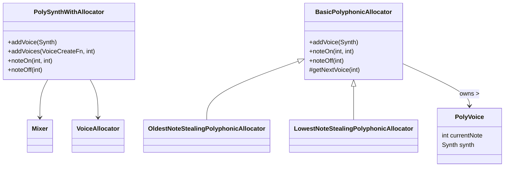

# Audio and MIDI Engine Architecture – Polyphonic Synth Voice Management

The **Polyphonic Synth Voice Management** subsystem handles MIDI-driven polyphony by allocating and mixing multiple synth voices. It leverages a templated `PolySynthWithAllocator` that combines a **Tonic** mixer with a **voice allocator**. The allocator maintains **active** and **inactive** voice queues, selects voices for new notes, and implements stealing strategies when voices run out. Each voice is a `Tonic::Synth` instance with parameters for MIDI note, gate, velocity, and voice number. MIDI events (`noteOn`/`noteOff`) are routed to the correct voice parameters to trigger sound generation.

## PolySynthWithAllocator Template

This template class wraps a `Tonic::Synth` to manage multiple voices and mix their outputs.

```cpp
template<typename VoiceAllocator>
class PolySynthWithAllocator : public Synth {
public:
  PolySynthWithAllocator() {
    setOutputGen(mixer);
  }

  void addVoice(Synth synth) {
    allocator.addVoice(synth);
    mixer.addInput(synth);
  }

  typedef Synth (VoiceCreateFn)();
  void addVoices(VoiceCreateFn createFn, int count) {
    for (int i = 0; i < count; ++i)
      addVoice(createFn());
  }

  void noteOn(int note, int velocity) {
    allocator.noteOn(note, velocity);
  }

  void noteOff(int note) {
    allocator.noteOff(note);
  }

protected:
  Mixer mixer;
  VoiceAllocator allocator;
};
typedef PolySynthWithAllocator<LowestNoteStealingPolyphonicAllocator> PolySynth;
```

- **setOutputGen(mixer):** Routes mixed voice outputs as the synth’s final output
- **addVoice / addVoices:** Registers voices both with the mixer and allocator
- **noteOn / noteOff:** Delegates MIDI events to the allocator

## BasicPolyphonicAllocator

The **BasicPolyphonicAllocator** tracks each voice’s state and handles simple allocation when notes arrive or stop.

### Key Members

- `struct PolyVoice { int currentNote; Synth synth; };`
- `vector<PolyVoice> voiceData;`
- `list<int> inactiveVoiceQueue;`
- `list<int> activeVoiceQueue;`

### Core Methods

1. **addVoice(Synth synth)**
2. Creates a `PolyVoice`, initializes `currentNote` to 0
3. Appends its index to `inactiveVoiceQueue`
4. **noteOn(int noteNumber, int velocity)**
5. Selects a voice via `getNextVoice`
6. Sets parameters:
7. `"polyNote"` ← `noteNumber`
8. `"polyGate"` ← `1.0`
9. `"polyVelocity"` ← `velocity`
10. `"polyVoiceNumber"` ← voice index
11. Moves the voice index from inactive to active queue
12. **noteOff(int noteNumber)**
13. Scans `activeVoiceQueue` for the oldest voice matching `noteNumber`
14. Sets its gate to 0.0 and moves it back to `inactiveVoiceQueue`

```cpp
void BasicPolyphonicAllocator::noteOn(int note, int velocity) {
  int i = getNextVoice(note);
  if (i < 0) return; 
  auto& v = voiceData[i];
  v.synth.setParameter("polyNote", note);
  v.synth.setParameter("polyGate", 1.0);
  v.synth.setParameter("polyVelocity", velocity);
  v.synth.setParameter("polyVoiceNumber", i);
  v.currentNote = note;
  activeVoiceQueue.remove(i);
  activeVoiceQueue.push_back(i);
  inactiveVoiceQueue.remove(i);
}

void BasicPolyphonicAllocator::noteOff(int note) {
  for (int i : activeVoiceQueue) {
    auto& v = voiceData[i];
    if (v.currentNote == note) {
      v.synth.setParameter("polyGate", 0.0);
      activeVoiceQueue.remove(i);
      inactiveVoiceQueue.remove(i);
      inactiveVoiceQueue.push_back(i);
      break;
    }
  }
}

int BasicPolyphonicAllocator::getNextVoice(int) {
  if (!inactiveVoiceQueue.empty())
    return inactiveVoiceQueue.front();
  return -1;  // no available voice
}
```

## Note Stealing Strategies

When all voices are active, **voice stealing** replaces an existing voice according to a strategy.

| Allocator Type | Stealing Strategy |
| --- | --- |
| BasicPolyphonicAllocator | No stealing (silence if no free voice) |
| OldestNoteStealingPolyphonicAllocator 🎵 | Steals the oldest active voice |
| LowestNoteStealingPolyphonicAllocator 🔊 | Steals the voice playing the lowest pitch below new |


```cpp
int OldestNoteStealingPolyphonicAllocator::getNextVoice(int note) {
  int v = BasicPolyphonicAllocator::getNextVoice(note);
  if (v >= 0) return v;
  if (!activeVoiceQueue.empty())
    return activeVoiceQueue.front();
  return -1;
}

int LowestNoteStealingPolyphonicAllocator::getNextVoice(int note) {
  int v = BasicPolyphonicAllocator::getNextVoice(note);
  if (v >= 0) return v;
  int lowestNote = note, lowestVoice = -1;
  for (int i : activeVoiceQueue) {
    auto& pv = voiceData[i];
    if (pv.currentNote < lowestNote) {
      lowestNote = pv.currentNote;
      lowestVoice = i;
    }
  }
  return lowestVoice;
}
```

```card
{
    "title": "Voice Stealing",
    "content": "Stealing reallocates existing active voices when no inactive voices remain."
}
```

## Voice Creation and Integration

In `**main.cpp**`, a helper function builds each synth voice. It adds four parameters the allocator uses to control frequency, gate, velocity, and detuning:

```cpp
Synth createSynthVoice() {
  Synth s;
  auto noteNum   = s.addParameter("polyNote",    0.0);
  auto gate      = s.addParameter("polyGate",    0.0);
  auto velocity  = s.addParameter("polyVelocity",0.0);
  auto voiceNum  = s.addParameter("polyVoiceNumber",0.0);

  auto voiceFreq = ControlMidiToFreq().input(noteNum)
                   + voiceNum * 1.2;  // slight detune

  auto env = ADSR().attack(0.04).decay(0.1)
            .sustain(0.8).release(0.6)
            .doesSustain(true).trigger(gate);

  auto filter = LPF24().cutoff(voiceFreq * 0.5 + 200)
                 .Q(1.0 + velocity * 0.02);

  auto osc = SquareWave().freq(voiceFreq) * SineWave().freq(50);
  auto out = ((osc * env) >> filter)
             * (0.02 + velocity * 0.005);

  s.setOutputGen(out);
  return s;
}
```

### MIDI Callback Integration

MIDI events from **RtMidi** invoke `noteOn`/`noteOff` on the global `PolySynth poly;`. The allocator handles all routing:

```cpp
void midiCallback(double, vector<unsigned char>* msg, void*) {
  int msgType = (*msg)[0] & 0xF0;
  int note    = (*msg)[1];
  int vel     = (*msg)[2];

  if (msgType==0x80 || (msgType==0x90 && vel==0)) {
    poly.noteOff(note);
  }
  else if (msgType==0x90) {
    poly.noteOn(note, vel);
  }
}
```

## Class Diagram



This architecture ensures robust polyphony, flexible voice-stealing, and seamless MIDI-to-audio processing in the **Spitonic** synthesizer platform.