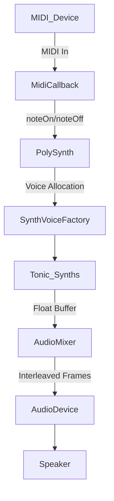

## Getting Started with the Polyphonic MIDI Synth Application – Project Purpose and Capabilities

Welcome to the **Polyphonic MIDI Synth Application**, part of the AUDIO_SPI collection of open-source Windows audio tools. This section explains the project’s goals, core features, and how it fits into the broader AUDIO_SPI ecosystem.

### 🎯 Project Purpose

The Polyphonic MIDI Synth Application serves to:

- Receive **real-time MIDI** input from any MIDI controller.
- Generate **polyphonic audio** using the Tonic synthesis library.
- Output sound via **cross-platform audio APIs** on Windows.
- Experiment with **spectral** and **partials-based** sound design.

This tool originated within the AUDIO_SPI initiative to explore software-based music creation on Windows.

### 🚀 Key Capabilities

- **Polyphony**: Supports multiple simultaneous voices, with customizable voice-stealing strategies.
- **Flexible Sound Engines**: Swappable synthesis modules (basic oscillators, buffer players, bandlimited oscillators, spectral lookup tables).
- **MIDI Handling**: Note-on/note-off processing with velocity sensitivity.
- **Audio I/O**: Integrates PortAudio (or RtAudio) and PortMidi (or RtMidi) for low-latency streaming.
- **Configurability**: Choose between various built-in synths at launch via command-line or registry settings.

### 📦 System Requirements

| Component | Minimum Version |
| --- | --- |
| Windows OS | Windows 7 or later |
| C++ Compiler | MSVC 2022 (VS 2022) or later |
| Tonic Library | v1.2 or newer |
| PortAudio | v19.6 |
| PortMidi | v1.0.4 |
| libsndfile | v1.0.29 (for sample table support) |
| FFTW (optional) | v3.3 (for spectral analysis) |


### 🔗 Dependencies and Architecture

| Module | Responsibility |
| --- | --- |
| **spiaudiodevice** (PortAudio) | Manages audio-device enumeration and streaming. |
| **portmidi/PortMidi** | Handles MIDI device I/O and callback routing. |
| **Tonic** | Synthesis engine (oscillators, envelopes, filters). |
| **PolySynth** (Simple allocator) | Allocates voices, mixes Tonic Synth instances. |
| **spitonicsynths** | Factory functions creating various Synth voices. |


### 🏗️ High-Level Architecture



### 🖥️ Core Components

#### Win32 Application Entry

The file **spitonicmidiinstrumentsynthwin32.cpp** initializes the Win32 window, parses command-line arguments, and sets up PortAudio/PortMidi for streaming and MIDI I/O .

```cpp
// Initialization excerpt
Pa_Initialize();
SPIAudioDevice::SelectAudioOutputDevice();
Tonic::setSampleRate(SAMPLE_RATE);
poly.addVoices(createSynthVoice, 8);
Pa_OpenStream(...);
Pa_StartStream(...);
```

#### Polyphonic Synth Example

In **PolySynth_main.cpp**, the application demonstrates a minimal polyphonic demo using RtAudio and RtMidi. It defines a simple voice creator and connects MIDI callbacks to noteOn/noteOff events .

```cpp
void midiCallback(...){
  if (msgtype == 0x90) poly.noteOn(b1, b2);
  else if (msgtype == 0x80) poly.noteOff(b1);
}

int main(){
  RtAudio dac;
  RtMidiIn midiIn;
  Tonic::setSampleRate(44100);
  poly.addVoices(createSynthVoice, 8);
  // Start audio and MIDI processing...
}
```

#### Synth Voice Factory

The file **spitonicsynths.cpp** contains multiple `createSynthVoice_vX()` factory functions. Each version configures a different synthesis approach—square + sine detune, buffer-based playback, spectral partial tables, etc. .

```cpp
Synth createSynthVoice(){
  Synth newSynth;
  auto noteNum = newSynth.addParameter("polyNote", 0.0);
  auto gate    = newSynth.addParameter("polyGate", 0.0);
  auto velocity = newSynth.addParameter("polyVelocity", 0.0);
  ControlGenerator freq = ControlMidiToFreq().input(noteNum);
  Generator tone = SquareWave().freq(freq);
  ADSR env = ADSR().attack(0.04).decay(0.1).sustain(0.8).release(0.6).trigger(gate);
  newSynth.setOutputGen(tone * env);
  return newSynth;
}
```

### 🛠️ Building the Application

1. **Clone the repository**

```bash
   git clone https://github.com/oifii/spitonicmidiinstrumentpolysynthspectrumwin32_vs2026.git
```

1. **Install Dependencies**
2. Build and install **PortAudio**, **PortMidi**, **libsndfile**, and **FFTW** (optional).
3. Place headers/libs where your compiler can find them.
4. **Open the Solution**
5. Launch `spitonicmidiinstrumentsynthwin32.vcxproj` in Visual Studio 2022.
6. **Configure Include/Lib Paths**
7. In project settings, add external library paths under **VC++ Directories**.
8. **Compile and Run**
9. Build in **Release** mode.
10. Run the executable to open the MIDI synth window.

### 🎛️ Running and Exploring

- Use the **command-line** or **registry settings** (via `spiregreadwrite`) to select between synth versions (`global_soundnumber`).
- Connect a MIDI controller or virtual MIDI port.
- Observe real-time voice allocation and audio rendering in the console.

---

By following this guide, you’ll grasp the **purpose**, **architecture**, and **capabilities** of the Polyphonic MIDI Synth Application, ready to extend or experiment with custom Tonic-based synthesis on Windows.