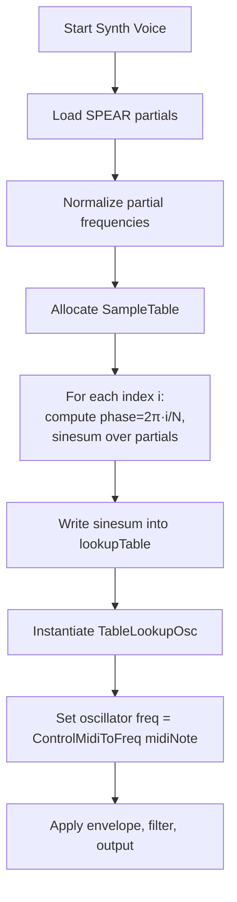

# Spectrum and Partials Processing – Building Custom Lookup Tables from Partials

A spectrum-matched wavetable oscillator generates a single-cycle waveform whose shape reflects the amplitude and frequency of each partial in an analyzed sound. This section explains how the code:

- Reads partial data from SPEAR text files
- Builds a custom `SampleTable` by summing sine waves at partial frequencies
- Wraps the table in a `TableLookupOsc` whose pitch is driven by MIDI

---

## 🔧 Key Components

| Class / Function | Purpose |
| --- | --- |
| **SpearTextPartialsReader** | Parses a SPEAR “partials” text file into two vectors: `partialfrequencies` and `partialamplitudes`. |
| **SampleTable** | Holds an array of floating-point samples representing one waveform cycle. |
| **TableLookupOsc** | A wavetable oscillator that reads from a `SampleTable`. |
| **ControlMidiToFreq** | Converts a MIDI note number into a frequency in Hz. |
| **SimpleInstrumentTableLookupSPEARSynth** | A `Synth` subclass wiring everything together. |


---

## 🔄 Processing Workflow



---

## 1. Reading Partial Data

The `SpearTextPartialsReader` class loads a text file of partials:

```cpp
// In SimpleInstrumentTableLookupSPEARSynth constructor
SpearTextPartialsReader mySpearTextPartialsReader("HPchanter C4 Vel_1(partials).txt");
// Normalize all partial frequencies to C4 = 261.6 Hz
for (auto& f : mySpearTextPartialsReader.partialfrequencies) {
  f /= 261.6f;
}
```

- **partialfrequencies**: float vector of harmonic indices (floats)
- **partialamplitudes**: float vector of corresponding amplitudes

---

## 2. Building the Lookup Table

1. **Choose table size**: e.g. `const unsigned int tablesize = 2500;`
2. **Allocate**:

```cpp
   SampleTable lookupTable(tablesize, 1);
   TonicFloat* tableData = lookupTable.dataPointer();
   TonicFloat norm = 1.0f / tablesize;
```

1. **Populate**: for each sample index, compute a phase and sum sines at each partial’s frequency:

```cpp
   for (unsigned int i = 0; i < tablesize; ++i) {
     TonicFloat phase = TWO_PI * i * norm;
     TonicFloat sinesum = 0.0f;
     for (size_t p = 0; p < mySpearTextPartialsReader.partialfrequencies.size(); ++p) {
       sinesum += mySpearTextPartialsReader.partialamplitudes[p]
                  * sinf(phase * mySpearTextPartialsReader.partialfrequencies[p]);
     }
     *tableData++ = sinesum;
   }
```

- **Normalization**: Dividing index by `tablesize` ensures phase ∈ [0, 2π)
- **Partial accumulation**: Each `sinf(phase × freq)` is scaled by its amplitude

---

## 3. Oscillator & MIDI Integration

Once the `SampleTable` is ready:

```cpp
// Create a wavetable oscillator that reads our custom table
TableLookupOsc osc = TableLookupOsc()
                      .setLookupTable(lookupTable)
                      .freq(ControlMidiToFreq().input(midiNote));
```

- **ControlMidiToFreq**: Maps the `midiNote` control parameter to a frequency value.
- **setLookupTable**: Assigns our spectrum-matched table.
- **.freq(...)**: Determines playback rate, controlling pitch via MIDI.

---

## 4. Synth Voice Wiring

In `SimpleInstrumentTableLookupSPEARSynth` (a `Synth` subclass):

1. **Parameters**:
2. `midiNote` & `midiNoteVelocity`
3. `trigger` (gate)
4. **Oscillator**: as above
5. **Amplitude envelope**: `ADSR().attack(...).trigger(trigger)`
6. **Filter**: e.g. `LPF24().cutoff(voiceFreq*0.5+200)`
7. **Output**: `setOutputGen(filter(input))`

This arrangement ensures each new voice uses the same spectrum shape while pitch, dynamics, and timbre controllers remain expressive.

---

## 📐 Design Considerations

- **Table Size**: Larger tables yield finer phase resolution but use more memory.
- **Power-of-Two+1**: `TableLookupOsc` can resize tables to optimum lengths.
- **Partial Normalization**: Dividing by a reference fundamental (e.g., 261.6 Hz) aligns harmonics.
- **Performance**: Summing dozens of sines per sample introduces CPU load—balance table size vs. polyphony.

```card
{
    "title": "Best Practice",
    "content": "Use moderate table sizes (e.g., 2049\u20134097) to balance spectral detail and performance."
}
```

---

## ⚙️ Dependencies & Relationships

| Module / Header | Role |
| --- | --- |
| `speartextpartialsreader.h` | SPEAR file parsing |
| `Tonic.h` | Core synthesis classes (`Synth`, `TableLookupOsc`, etc.) |
| `spitonicsynths.cpp` | Integrates this synth into the MIDI driver |
| PortAudio / PortMidi | I/O for audio output and MIDI input |


Together, these elements form a flexible spectrum-matched oscillator, allowing a Windows desktop MIDI-driven polyphonic synth to emulate the timbre of recorded instruments.