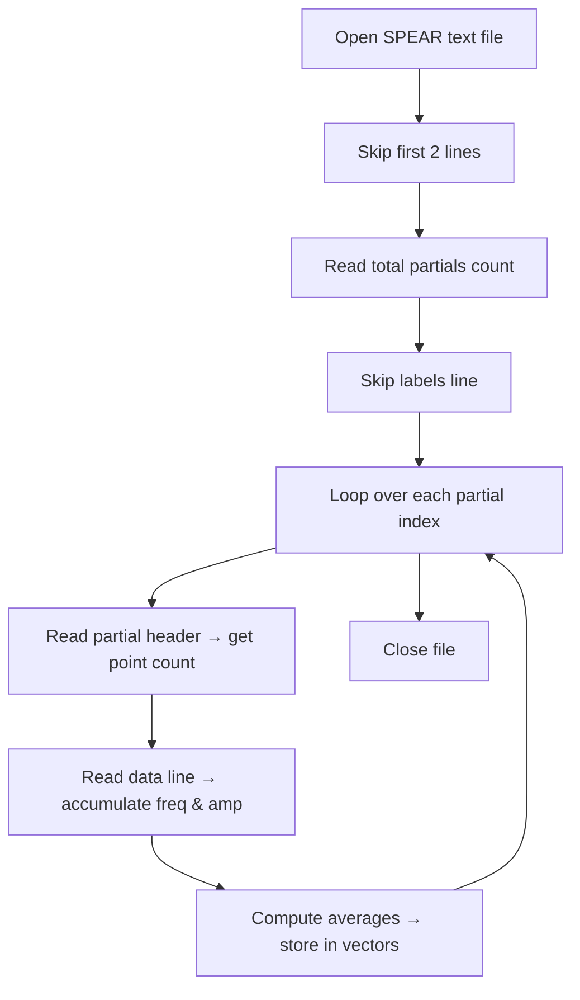

# Spectrum and Partials Processing – SPEAR Text Partials Files

This section describes how the synthesizer leverages **SPEAR**-exported text partials to capture and recreate the spectral evolution of recorded sounds. You will learn how to generate these files, parse them with the `SpearTextPartialsReader` class, and integrate the parsed data into a Tonic-based synth.

## SPEAR Text Partials Format

SPEAR produces a plain-text file listing, for each partial, its time span, frequencies, and amplitudes. The format is:

- **Line 1–2:** Headers (ignored)
- **Line 3:** Total number of partials
- **Line 4:** Column labels (ignored)
- **Lines 5…:** Alternating
- **Header lines**: `<partial_index> <point_count>`
- **Data lines**: `<time> <frequency> <amplitude>` repeated for each point

Example excerpt from `a1_tum_ot_l29(partials).txt`:

```txt
par-text-partials-format point-type time frequency amplitude
partials-count 214
partials-data
0 6       0.000000 13864.357422 0.000147
    0.012494 13866.513672 0.000200
    0.024989 13868.941406 0.000171
    0.037483 13870.166992 0.000093
    0.049977 13889.049805 0.000038
    0.062472 13889.049805 0.0000001
1 7       0.000000 12980.643555 0.000164
    … 
```

This file lists 214 partials, each with a small sequence of frequency/amplitude points .

## Generating Text Partials with SPEAR 🎵

To obtain compatible partials files:

1. Download and install SPEAR from the Klingbeil website:

```txt
   http://www.klingbeil.com/spear/SPEAR_latest_setup.exe
```

1. Launch `SPEAR_latest_setup.exe` and **load** your WAV file.
2. Click **Analyze Spectrum**, then **Export Partials** → **Text**.
3. Save the resulting `.txt` file in your project’s data folder.

Once exported, these files feed directly into the `SpearTextPartialsReader` .

## SpearTextPartialsReader Class

The `**SpearTextPartialsReader**` class loads a SPEAR text partials file and computes **average frequency** and **average amplitude** for each partial.

### Header: `speartextpartialsreader.h`

| Member | Type | Purpose |
| --- | --- | --- |
| `vector<float> partialfrequencies` | Frequency averages | One value per partial |
| `vector<float> partialamplitudes` | Amplitude averages | One value per partial |
| `SpearTextPartialsReader(const char* filename)` | Constructor | Parses the file and populates vectors |


### Implementation: `speartextpartialsreader.cpp`

```cpp
SpearTextPartialsReader::SpearTextPartialsReader(const char* filename){
  ifstream myfile(filename);
  int linecount=0, partialscount=0, partialpointscount=0;
  string line;

  while (getline(myfile, line)) {
    ++linecount;
    if (linecount <= 2) continue;                      // skip headers
    else if (linecount == 3) {                        // read partial count
      istringstream buf(line);
      vector<string> tokens{istream_iterator<string>(buf), {}};
      partialscount = stoi(tokens[1]);
    }
    else if (linecount == 4) continue;                // skip labels
    else if (linecount % 2) {                         // partial header
      istringstream buf(line);
      vector<string> tokens{istream_iterator<string>(buf), {}};
      partialpointscount = stoi(tokens[1]);
    }
    else {                                            // data line
      istringstream buf(line);
      vector<string> tokens{istream_iterator<string>(buf), {}};
      float freqSum=0, ampSum=0;
      for (int i=0, tok=0; i<tokens.size(); ++i) {
        if (++tok == 2) freqSum += stof(tokens[i]);
        else if (tok == 3) { ampSum += stof(tokens[i]); tok=0; }
      }
      partialfrequencies.push_back(freqSum/partialpointscount);
      partialamplitudes .push_back(ampSum /partialpointscount);
    }
  }
}
```

This reader reports counts to `stdout` and gracefully handles file errors .

## Data-Flow Diagram



## Integrating Partials into a Tonic Synth

Once parsed, the **frequency** and **amplitude** vectors feed a **wave-table** oscillator. For example, in `SimpleInstrumentTableLookupSPEARSynth`:

```cpp
// Load partials (A1 = 55 Hz)
SpearTextPartialsReader reader("a1_tum_ot_l29(partials).txt");
for (auto& f : reader.partialfrequencies) f /= 55.f;

// Build table of size 2500
SampleTable table(2500,1);
float norm = 1.f/2500, phase, sum;
float* data = table.dataPointer();
for (unsigned i=0; i<2500; ++i){
  phase = TWO_PI * i * norm; sum = 0;
  for (size_t p=0; p<reader.partialfrequencies.size(); ++p)
    sum += reader.partialamplitudes[p] * sinf(phase * reader.partialfrequencies[p]);
  *data++ = sum;
}

ControlGenerator noteFreq = ControlMidiToFreq().input(addParameter("midiNote"));
Generator osc = TableLookupOsc().table(table).freq(noteFreq);
setOutputGen(osc * addParameter("gain"));
```

This demonstrates how spectral data shapes rich, **spectra-based synthesis** .

---

> **Key Takeaway** SPEAR text partials empower evolving-spectrum synthesis by providing a simple, human-readable format. The `SpearTextPartialsReader` class abstracts file parsing, while Tonic’s `SampleTable` and `TableLookupOsc` deliver playback of the extracted partial information.