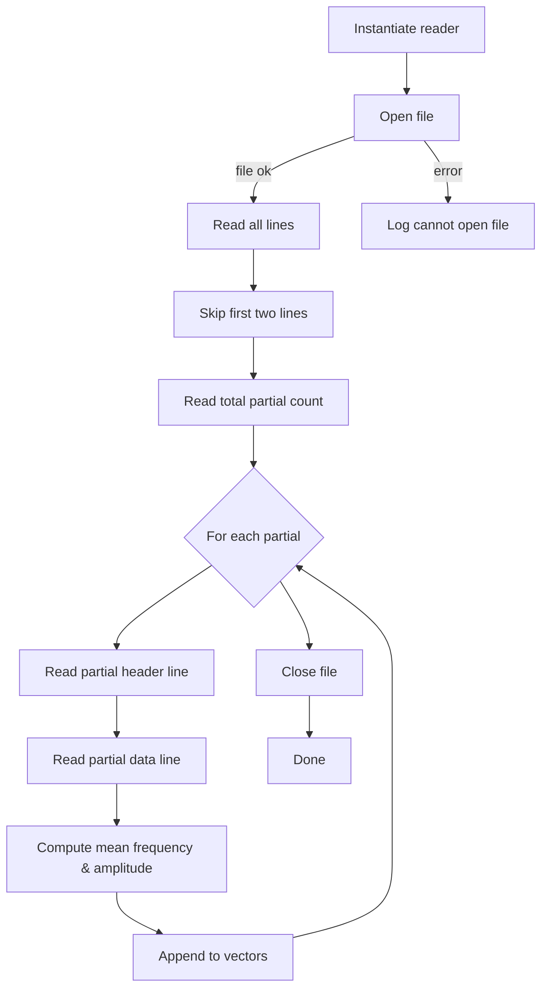

# Spectrum and Partials Processing

This section covers the **SpearTextPartialsReader** component, responsible for parsing SPEAR-generated text partials files. These parsed **frequencies** and **amplitudes** feed directly into custom oscillator lookup tables for realistic spectral resynthesis.

## SpearTextPartialsReader Component 🎵

The **SpearTextPartialsReader** class reads a SPEAR-formatted text file containing partial data, extracts per-partial frequency and amplitude values, and stores them in public vectors. Clients normalize these raw Hertz values against a reference pitch (e.g., C4 = 261.6 Hz) before constructing lookup tables.

### Class Definition

Here is the public interface for the reader:

```cpp
// Filename: speartextpartialsreader.h
#include <vector>
using namespace std;

class SpearTextPartialsReader {
public:
  vector<float> partialfrequencies;  // Raw frequencies in Hertz
  vector<float> partialamplitudes;   // Corresponding amplitudes

  SpearTextPartialsReader(const char* filename);
};
```

The constructor opens and parses the file, populating the two vectors .

### Public Members

- **partialfrequencies**

A list of raw partial frequencies (Hz), one per partial.

- **partialamplitudes**

A list of raw partial amplitudes, matching the frequencies vector.

- **SpearTextPartialsReader(const char* filename)**

Opens the given file, parses its lines, and fills the above vectors.

### Parsing Workflow

The constructor implements these steps:



### File Format and Parsing Logic

The SPEAR text file follows a predictable structure:

| Line # | Content | Action |
| --- | --- | --- |
| -------------: | ---------------------------------- | ----------------------------------------- |
| 1–2 | Metadata / Comments | Skip |
| 3 | Integer: number of partials | Parse into `partialsCount` |
| 4 | Separator or header | Skip |
| 5, 7, 9… | Partial header (point count) | Extract `pointsCount` |
| 6, 8, 10… | Partial data: time, freq, amp | Sum frequency & amplitude over points |
| After loop | — | Compute average and push into vectors |


The code iterates tokens per line, skipping time stamps, summing frequency and amplitude values, then calculating averages per partial .

### Usage Example

In a custom **Tonic** synth, you might use the reader as follows:

```cpp
// Filename: SimpleInstrumentTableLookupSPEARSynth.h
SpearTextPartialsReader reader("HPchanter C4 Vel_1(partials).txt");  
// Normalize by reference pitch (C4 = 261.6 Hz)
for (auto& f : reader.partialfrequencies) f /= 261.6f;  
// Build a sample table from normalized partials
SampleTable lookupTable = SampleTable(2500, 1);
auto tableData = lookupTable.dataPointer();
for (unsigned i = 0; i < 2500; ++i) {
  float phase = TWO_PI * (i / 2500.0f);
  float sum = 0.0f;
  for (size_t p = 0; p < reader.partialfrequencies.size(); ++p) {
    sum += reader.partialamplitudes[p]
         * sinf(phase * reader.partialfrequencies[p]);
  }
  tableData[i] = sum;
}
```

This pipeline enables spectral resynthesis from real-world partial data .

### Dependencies

- `<fstream>`, `<iostream>`, `<sstream>`, `<iterator>` for file I/O
- `<vector>`, `<string>` for data storage and tokenization
- Uses `std` namespace for brevity

### Error Handling

- If the file fails to open, the constructor logs:

```cpp
  std::cout << "can't open file " << filename << "\n";
```

- After parsing, it prints counts for debugging:

```cpp
  std::cout << partialfrequencies.size() << "\n";
  std::cout << partialamplitudes.size() << "\n";
```

```card
{
    "title": "File Naming",
    "content": "Ensure files follow the pattern name(partials).txt so the reader locates and parses them correctly."
}
```

### Integration with the Synth

Once normalized, these vectors drive **TableLookupOsc** or **SampleTable** generators in Tonic. By matching partial frequencies to oscillator phases, the synth achieves highly realistic timbres based on analyzed audio spectra.