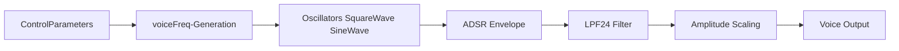

# Synth Sound Designs (Tonic Voices)

This section covers the **Basic Polyphonic Synth Voice**, the foundational voice design used in our MIDI-driven polyphonic synthesizer. It defines how individual voices respond to MIDI note events, shape their timbre, and integrate into a polyphonic allocator.

## Basic Polyphonic Synth Voice

The function `createSynthVoice` returns a `Tonic::Synth` configured with:

- Four **control parameters** for MIDI-driven modulation.
- A **frequency generator** with slight detuning per voice.
- A **square-wave oscillator** enriched by a low-frequency sine modulator.
- An **ADSR envelope** to shape amplitude.
- A **resonant low-pass filter** whose cutoff and resonance respond to velocity.
- **Velocity-dependent scaling** for final output level.

```cpp
Synth createSynthVoice(){
  Synth newSynth;
  ControlParameter noteNum      = newSynth.addParameter("polyNote",       0.0);
  ControlParameter gate         = newSynth.addParameter("polyGate",       0.0);
  ControlParameter noteVelocity = newSynth.addParameter("polyVelocity",   0.0);
  ControlParameter voiceNumber  = newSynth.addParameter("polyVoiceNumber",0.0);

  ControlGenerator voiceFreq    = ControlMidiToFreq().input(noteNum)
                                 + voiceNumber * 1.2;           // slight detune
  Generator tone                = SquareWave().freq(voiceFreq)
                                 * SineWave().freq(50);         // LFO movement

  ADSR env                      = ADSR()
                                   .attack(0.04)
                                   .decay(0.1)
                                   .sustain(0.8)
                                   .release(0.6)
                                   .doesSustain(true)
                                   .trigger(gate);

  ControlGenerator filterFreq   = voiceFreq * 0.5 + 200;
  LPF24 filter                  = LPF24()
                                   .Q(1.0 + noteVelocity * 0.02)
                                   .cutoff(filterFreq);

  Generator output              = ((tone * env) >> filter)
                                 * (0.02 + noteVelocity * 0.005);

  newSynth.setOutputGen(output);
  return newSynth;
}
```

This implementation is the core of the **basic synth** voice design .

## Control Parameters

Each voice exposes four **ControlParameter** slots. They map MIDI and voice metadata to Tonic’s control graph.

| Parameter Name | Description |
| --- | --- |
| **polyNote** | MIDI note number (0–127) |
| **polyGate** | Gate signal (0 off, >0 on) |
| **polyVelocity** | MIDI velocity (0–127) |
| **polyVoiceNumber** | Voice index within the polyphonic allocator |


These parameters drive frequency, envelope, and filter behavior in real time.

## Frequency Generation

The **voiceFreq** control generator converts the MIDI note number to frequency and adds a tiny detune per voice:

- `ControlMidiToFreq().input(noteNum)`: Maps `polyNote` to Hz.
- `+ voiceNumber * 1.2`: Offsets each voice by up to a few Hz for a **chorus-like effect**.

## Oscillator Setup

The **tone** generator blends two simple oscillators:

- `SquareWave().freq(voiceFreq)`: Primary pulse waveform.
- `* SineWave().freq(50)`: LFO at 50 Hz for subtle amplitude modulation.

This combination adds harmonic richness and movement.

## Amplitude Envelope

The **ADSR envelope** shapes note dynamics:

- **Attack**: 0.04 s
- **Decay**: 0.1 s
- **Sustain**: 80% level
- **Release**: 0.6 s

It triggers on `polyGate` and holds the sustain until release .

## Filter Stage

A 24 dB/octave low-pass filter (LPF24) sculpts the tone:

| Setting | Source |
| --- | --- |
| **Cutoff** | `voiceFreq * 0.5 + 200` |
| **Resonance (Q)** | `1.0 + noteVelocity * 0.02` |


Higher velocity increases resonance, making brighter, snappier tones at louder notes.

## Output Scaling

The final **output** generator multiplies the filtered tone by:

```plaintext
0.02 + (noteVelocity * 0.005)
```

This ensures soft notes remain audible while loud notes are emphasized.

## Voice Signal Flow



This flow represents how MIDI data traverses the voice graph into audio output.

## Integration with PolySynth

The `Basic Polyphonic Synth Voice` integrates into a polyphonic allocator:

- **PolySynthWithAllocator** manages voice assignment and mixing .
- Voices are instantiated in the main application:

```cpp
poly.addVoices(createSynthVoice, 8); // basic synth
```

This creates eight independent voices, enabling up to eight-note polyphony.

```card
{
    "title": "Design Note",
    "content": "Using voiceNumber for detune creates a natural, ensemble effect."
}
```

By adjusting the LFO rate, envelope times, and filter mappings, this **base voice** can be extended into richer sound designs.