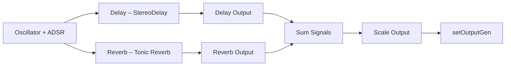

# Synth Sound Designs (Tonic Voices) – Delay and Reverb-Based Synths

This section describes two ambient-focused voice designs built with Tonic:

1. **Delay-Based Synths**, which wrap a core oscillator and envelope in a stereo delay.
2. **Reverb-Based Synths**, which feed the signal through a lush reverb unit.

Both designs expose key effect parameters as **ControlParameters**, enabling real-time shaping of echoes and ambience.

---

## 🎛️ Delay-Based Synth Voices

Delay-based voices take a basic oscillator + ADSR envelope and wrap them in a `StereoDelay`. This creates spatial echoes with independently controllable left/right delay times, feedback, and mix levels.

| Parameter | Default | Range | Description |
| --- | --- | --- | --- |
| **delay_left** | 0.5 | 0.0 – 3.0 s | Left-channel delay time |
| **delay_right** | 0.55 | 0.0 – 3.0 s | Right-channel delay time |
| **delay_feedback** | 0.4 | 0.0 – 1.0 | Amount of feedback (echo repeats) |
| **delay_drylevel** | 0.5 | 0.0 – 1.0 | Level of the un-delayed (dry) signal |
| **delay_wetlevel** | 0.5 | 0.0 – 1.0 | Level of the delayed (wet) signal |


Key steps in the signal chain:

- Generate an oscillator (e.g., `TableLookupOsc`)
- Multiply by an ADSR envelope
- Input into `StereoDelay` with exposed parameters
- Route delay output into the voice generator

```cpp
// Define the stereo delay and expose controls
StereoDelay delay = StereoDelay(3.0f, 3.0f, 3.0f, 3.0f)
  .delayTimeLeft( newSynth.addParameter("delay_left", 0.5f).min(0.0f).max(3.0f) )
  .delayTimeRight( newSynth.addParameter("delay_right", 0.55f).min(0.0f).max(3.0f) )
  .feedback( newSynth.addParameter("delay_feedback", 0.4f).min(0.0f).max(1.0f) )
  .dryLevel( newSynth.addParameter("delay_drylevel", 0.5f).min(0.0f).max(1.0f) )
  .wetLevel( newSynth.addParameter("delay_wetlevel", 0.5f).min(0.0f).max(1.0f) );

// Feed oscillator * amplitude into delay
Generator tone = delay.input(
  osc * newSynth.addParameter("base_amp", 0.80f).min(0.0f).max(1.0f)
);
newSynth.setOutputGen( tone * env );  // Apply envelope 
```

- **Design Note:** Wrapping the core voice in a delay yields rhythmic echoes. Tweaking `feedback` and `wetLevel` crafts anything from subtle slapback to infinite loops.

```card
{
    "title": "Delay Controls",
    "content": "Exposing delay parameters lets you sculpt echo timing and intensity in real time."
}
```

---

## 🎚️ Reverb-Based Synth Voices

Reverb-based voices pass the core signal through Tonic’s `Reverb` unit. This produces a lush, ambient texture by blending the dry voice with a reverberated tail.

| Parameter | Default | Range | Description |
| --- | --- | --- | --- |
| **dry** | –6 dB | –60 dB – 0 dB | Dry signal level (converted to linear) |
| **wet** | –20 dB | –60 dB – 0 dB | Wet (reverb) signal level |
| **decayTime** | 1.0 s | 0.1 – 10 s | Reverb decay time |
| **lowDecay** | 16 000 Hz | 4 000 – 20 000 Hz | Low-pass cutoff on decay tail |
| **hiDecay** | 20 Hz | 20 – 250 Hz | High-pass cutoff on decay tail |
| **preDelay** | 0.001 s | 0.001 – 0.05 s | Pre-delay before reverb onset |
| **inputLPF** | 18 000 Hz | 4 000 – 20 000 Hz | Input low-pass cutoff |
| **inputHPF** | 20 Hz | 20 – 250 Hz | Input high-pass cutoff |
| **density** | 0.5 | 0.0 – 1.0 | Early-reflection density |
| **shape** | 0.5 | 0.0 – 1.0 | Room shape characteristic |
| **size** | 0.5 | 0.0 – 1.0 | Virtual room size |
| **stereo** | 0.5 | 0.0 – 1.0 | Stereo spread of the reverberation |


```cpp
// Configure the Tonic reverb with control parameters
Reverb reverb = Reverb()
  .preDelayTime( preDelay )
  .inputLPFCutoff( inputLPF )
  .inputHPFCutoff( inputHPF )
  .decayTime( time )
  .decayLPFCutoff( lowDecay )
  .decayHPFCutoff( hiDecay )
  .stereoWidth( stereo )
  .density( density )
  .roomShape( shape )
  .roomSize( size )
  .dryLevel( ControlDbToLinear().input(dry) )
  .wetLevel( ControlDbToLinear().input(wet) );

// Apply reverb to the tone and scale to avoid clipping
Generator tone2 = (( tone ) >> reverb) * 2.0f;
newSynth.setOutputGen( tone2 * env );  // Layer envelope after reverb 
```

- **Design Note:** Summing the un-reverberated (dry) and the reverb output yields spacious textures. Adjust `decayTime` and `density` to dial in hall-like or plate-like ambiences.

```card
{
    "title": "Reverb Tips",
    "content": "Use small rooms and short decay for tight ambience; large rooms for dreamy pads."
}
```

---

## 🛠️ Integration into Polyphonic Synth Architecture

Both delay- and reverb-based voices plug into the polyphonic engine via `createSynthVoice_vX()` functions. Each voice:

- Receives per-voice **ControlParameters** (`polyNote`, `polyGate`, `polyVelocity`)
- Generates a core oscillator + ADSR
- Routes through the chosen **effect** chain
- Mixes and scales the output
- Registers via `newSynth.setOutputGen(...)`



This modular pattern allows easy swapping or chaining of effects to craft rich, evolving textures.

---

## 🔗 Relationships & Dependencies

- **Tonic Library**: Provides `StereoDelay`, `Reverb`, envelope generators, and parameter handling.
- **SynthFactory**: Registers voices for dynamic instantiation.
- **ControlParameters**: Exposed to the host (GUI or MIDI) for real-time tweaking.

By centralizing effect configuration in the voice construction functions, the synth ensures consistent control mapping and seamless integration with the Windows MIDI host.