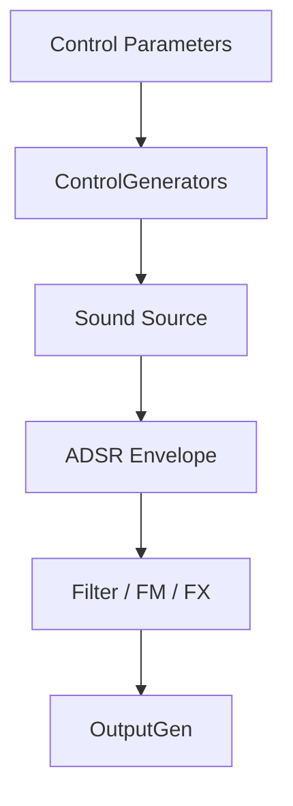

# Synth Sound Designs (Tonic Voices) – Noise, Filter, and FM-Based Synths 🎶

This section presents a set of **Tonic**-based synth voices that explore non-tonal and semi-tonal textures. Each voice follows a consistent pattern:

1. **Declare** control parameters (MIDI note, gate, velocity, voice index).
2. **Map** MIDI inputs to audio rates via `ControlMidiToFreq`.
3. **Generate** raw sound sources (noise, oscillators, samples).
4. **Shape** dynamics with **ADSR** envelopes.
5. **Process** signals through filters, modulation, and effects.
6. **Expose** adjustable parameters via `addParameter`.

Each subsection below details one synth variant, its purpose, signal chain, and key parameters.

---

## Common Voice Architecture

Every polyphonic voice instantiation shares this template:

```cpp
Synth newSynth;
ControlParameter noteNum      = newSynth.addParameter("polyNote", 0.0);
ControlParameter gate         = newSynth.addParameter("polyGate", 0.0);
ControlParameter velocity     = newSynth.addParameter("polyVelocity", 0.0);
ControlParameter voiceNumber  = newSynth.addParameter("polyVoiceNumber", 0.0);

ControlGenerator voiceFreq    = ControlMidiToFreq().input(noteNum)
                                 + voiceNumber * detuneAmount;

// Build your Generator chain here:
// - raw source (oscillator/noise/sample)
// - ADSR envelope triggered by gate
// - filters, modulators, effects

newSynth.setOutputGen(finalGenerator);
return newSynth;
```



---

## 🔊 Filtered Noise Synth (createSynthVoice_v10)

This voice sculpts **pink noise** with time-varying filters and adds depth with reverb and panning. It creates evolving, semi-tonal textures.

| Parameter | Default | Description |
| --- | --- | --- |
| **polyNote** | 0.0 | MIDI note number |
| **polyGate** | 0.0 | Note on/off trigger |
| **cutoff** | 0.5 | Filter cutoff control (0…1) |
| **Q** | 5 | Filter resonance, smoothed |


Key signal chain steps:

- **PinkNoise** source
- **ADSR** envelope with dynamic decay (`pulseLen * 0.5`)
- **Band-pass** and **low-pass** filtering via `BPF24` and `LPF24`
- **Stereo** panning across voices
- **Reverb** depth (`wetLevel` adjustable)

```cpp
Generator noise       = PinkNoise();
ControlGenerator env  = ADSR().attack(0.01).decay(pulseLen*0.5)
                          .sustain(0.8).release(0.01)
                          .trigger(pulse);
Generator voice       = noise * env;
Generator filtered    = BPF24().cutoff(voiceFreq)
                         .input(voice).Q(q)
                       + 0.5 * LPF24().cutoff(filterFreq)
                         .input(voice).Q(q);
Generator stereoVoice = MonoToStereoPanner().pan(pan)
                         .input(filtered);
Generator reverb      = Reverb().input(allVoices)
                         .density(1).wetLevel(0.9)
                         .decayTime(1);
Generator output      = (allVoices + reverb)
                         * ADSR(...).trigger(gate);
newSynth.setOutputGen(output);
```

(Adapted from createSynthVoice_v10)

---

## 🎛️ Filter Synth (createSynthVoice_v11)

This voice uses a **sample buffer** as its source and sculpts it with a **band-pass filter**. It delivers resonant, rhythmic timbres.

| Parameter | Default | Description |
| --- | --- | --- |
| **polyNote** | 0.0 | MIDI note |
| **polyGate** | 0.0 | Note trigger |
| **track1volume1** | 1.0 | Sample playback volume (0…1) |
| **tempo** | file-based | Metro BPM synced to sample length |


Signal chain highlights:

- **BufferPlayer** triggers an external WAV sample
- **ControlMetro** synced to sample-derived BPM
- **BPF24** band-pass filter at `voiceFreq`
- **Mix** of filtered sample, reverb and delay adds space

```cpp
SampleTable buffer1(...);
BufferPlayer bPlayer1;
bPlayer1.setBuffer(buffer1).loop(false);
ControlGenerator metro = initialTrigger + ControlMetro().bpm(bpm);
Generator track1 = bPlayer1.trigger(metro) * track1volume1;
Generator filtered = track1 >> BPF24().cutoff(voiceFreq);
Generator tone     = filtered + Reverb().input(filtered)*wetMix
                              + StereoDelay().input(filtered)*delayMix;
newSynth.setOutputGen(tone);
```

(Adapted from createSynthVoice_v11)

---

## 🎚️ FM Drone Synth (createSynthVoice_v12)

This voice combines **two sine oscillators** in an FM topology for rich, controllable drones. Parameters allow dynamic spectral shifts.

| Parameter | Default | Description |
| --- | --- | --- |
| **polyNote** | 0.0 | MIDI note |
| **carrierPitch** | 32.0 | Base carrier MIDI note |
| **modIndex** | 1.0 | FM modulation depth (0…1) |
| **lfoAmt** | 1.0 | Slow LFO modulation amount (0…1) |
| **volume** | 0.0 | Output level (dB) |


Core FM chain:

- `rCarrierFreq` derived from `noteNum`
- `rModFreq` at four times carrier frequency
- Modulation: carrier += sine(modFreq) * rModFreq * modIndex
- Slow LFO (`LFNoise`) adds subtle pitch variation

```cpp
Generator rCarrierFreq = ControlMidiToFreq().input(noteNum).smoothed();
Generator rModFreq     = rCarrierFreq * 4.0f;
Generator tone         =
  SineWave().freq(
    rCarrierFreq 
    + (SineWave().freq(rModFreq) * rModFreq 
      * (modIndex.smoothed() 
         * (1.0f + LFNoise().setFreq(0.5f) * lfoAmt.smoothed())))
  ) * ControlDbToLinear().input(volume);
newSynth.setOutputGen(tone >> LPF24().cutoff(filterFreq));
```

(Adapted from createSynthVoice_v12)

---

## 🌬️ LF Noise Synth (createSynthVoice_v13)

This voice uses **low-frequency noise** to modulate a sine oscillator, yielding organic, shifting textures.

| Parameter | Default | Description |
| --- | --- | --- |
| **polyNote** | 0.0 | MIDI note |
| **sinefreq** | 500 | Base sine frequency (Hz) |
| **noisefreq** | 100 | LF noise rate (Hz) |
| **vol** | 1.0 | Output level multiplier |


Signal chain:

- **SineWave** base oscillator at `sinefreq + sinefreq * LFNoise()`
- **ADSR** envelope for note shaping
- **LPF24** smoothing filter for warmth
- Final gain scaled by velocity and vol parameter

```cpp
ControlParameter pitch   = newSynth.addParameter("sinefreq", 500);
ControlParameter noiseFr = newSynth.addParameter("noisefreq", 100);
Generator tone           =
  SineWave().freq(
    pitch 
    + pitch * LFNoise().setFreq(voiceFreq + voiceFreq * LFNoise().setFreq(noiseFr))
  ) * newSynth.addParameter("vol", 1.0);

Generator env         = ADSR().attack(0.04).decay(0.1)
                          .sustain(0.8).release(0.6)
                          .trigger(gate);
Generator output      = (tone * env) >> LPF24().cutoff(filterFreq);
newSynth.setOutputGen(output);
```

(Adapted from createSynthVoice_v13)

---

Each of these voices demonstrates how to leverage Tonic’s **Generators**, **ControlGenerators**, **ADSR** envelopes, filters, and effects. Parameters are exposed through `addParameter`, enabling real-time control via MIDI or UI sliders. You can register and select these voices in **spitonicsynths.h** for integration into the **polyphonic engine**.