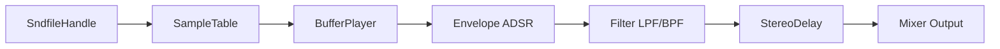

# Synth Sound Designs (Tonic Voices)

This section covers **sample-driven** and **events-style** synthesizer voices built with the [Tonic](https://github.com/TonicAudio/Tonic) library. These voices load external audio, store it in a `SampleTable`, and use `BufferPlayer` instances—triggered by MIDI or internal clocks—to create playable instruments and evolving textures.

---

## Sample-Driven Synths 🎵

Sample-driven synths play back pre-recorded stereo audio. They:

- Load a WAV/AIFF file via `SndfileHandle`
- Store samples in a `SampleTable`
- Use `BufferPlayer` to read and loop or one-shot the audio
- Trigger playback through a `ControlGenerator` (e.g., ADSR, Metro)
- Shape the output with envelopes, filters, and delays

### Key Classes

| Synth Class | Purpose | File & Citation |
| --- | --- | --- |
| **SimpleInstrumentBufferPlayerSynth** | One-shot sample player with ADSR & delay | SimpleInstrumentBufferPlayerSynth.h |
| **FilterExpSynth** | Sequenced sample playback with filtering | FilterExpSynth.h |
| **BufferPlayerExpSynth** | Basic buffer-playback demo | BufferPlayerExpSynth.h (see codebase) |
| **StepSequencerBufferPlayerEffectExpSynth** | Step-sequenced sample slices with effects | StepSequencerBufferPlayerEffectExpSynth.h |


### Workflow Overview



1. **Load Audio**:

Use `SndfileHandle` to open a file, assert sample rate and channel count, then read into a `SampleTable`.

1. **BufferPlayer Setup**:

`BufferPlayer::setBuffer(...)` configures looping and triggers.

1. **Trigger & Envelope**:

A `ControlTrigger` or `ControlMetro` fires the sample; ADSR shapes its amplitude.

1. **Filtering & Delay**:

Optional `LPF24`, `BPF24`, or `StereoDelay` add movement and space.

💡 **Best Practice**

```card
{
    "title": "Sample Integrity",
    "content": "Always verify `samplerate()` and `channels()` before playback."
}
```

---

## Events-Style Synths 🌌

Events synths layer or sequence multiple `BufferPlayer` instances (or other generators) to craft **evolving textures** and rhythmic clusters.

### 1. createSynthVoice_v4

*Events BufferPlayer Synth* – under construction

- **Voices**: Spawns `NUM_VOICES = 5` parallel buffer players
- **Sample**: Loads a Highland Pipes drone via `SndfileHandle` into `SampleTable`
- **Triggers**:
- `initialTrigger` fires immediately
- `resetTrigger` combines with `ControlMetro` and `ControlRandom` for variable timing
- **Envelope**: ADSR or custom pulse-length shaping
- **Processing**: Panning, filtering, and stereo delays

```cpp
SndfileHandle file1(".../HPdrones.wav");
assert(file1.samplerate() == 44100);
assert(file1.channels()   == 2);
SampleTable buffer1(file1.frames(), file1.channels());
file1.read(buffer1.dataPointer(), file1.frames()*file1.channels());

BufferPlayer bPlayer1;
bPlayer1.setBuffer(buffer1).loop(false);
```

#### Voice Sequencing Loop

```cpp
for (int i = 0; i < NUM_VOICES; i++) {
  ControlTrigger initialTrigger; initialTrigger.trigger();
  auto resetTrig = initialTrigger + ControlMetro().bpm(
    ControlRandom().min(10).max(15)
  );
  auto noiseTrigger = ControlMetro().bpm(
    ControlRandom().min(50).max(200).trigger(resetTrig)
  );
  auto pulseLen = ControlRandom().min(0.1).max(0.5)
                       .trigger(resetTrig);
  auto pulse    = ControlPulse().length(pulseLen)
                       .trigger(noiseTrigger);
  auto env      = ADSR(0.01,0,0.5,0.01)
                       .decay(pulseLen*0.5)
                       .trigger(pulse);
  auto voice    = bPlayer1.trigger(pulse) * env;
  // pan & mix voices...
}
```

### 2. StepSequencerBufferPlayerExpSynth

*Sequenced sample playback without effects*

- Uses `ControlStepper` + `ControlSwitcher` for step-based sample selection
- Demonstrates sequencing across an 8-step pattern

### 3. StepSequencerBufferPlayerEffectExpSynth

*Sequenced sample playback with delay & panning*

- Adds per-step volume controls
- Layers stereo delays for spatial depth

---

## Integration & Architecture

All sample-driven and event synths:

- Inherit from `Tonic::Synth`
- Register via `TONIC_REGISTER_SYNTH(...)`
- Are instantiated by the host (e.g., in `spitonicsynths.cpp`)
- Are added to `PolySynth` via `poly.addVoices(...)` based on user selection

**Dependencies**:

- PortAudio / RtAudio for audio I/O
- RtMidi / PortMidi for MIDI
- Tonic synthesis framework
- libsndfile (`sndfile.hh`) for sample decoding

---

These **Tonic Voices** showcase how to blend sample playback with dynamic control generators to build both **playable instruments** and **automated textures**, forming the core of the project’s MIDI-driven, polyphonic synthesizer.