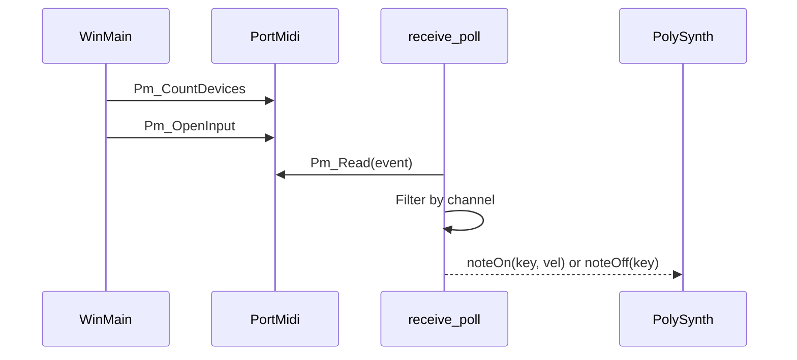

# Using the Application: MIDI, Sounds, and Controls

This section explains how the application handles MIDI input. It covers the **requirements**, **configuration**, and the flow from receiving MIDI messages to driving the synthesizer’s note events.

## MIDI Input Requirements and Configuration

The application requires at least one available MIDI input port. It uses PortMidi to:

- Enumerate all input-capable devices at startup.
- Map each device’s **name** to a numeric **device ID**.
- Open a stream on the selected device.
- Read incoming MIDI messages and route them to the polyphonic synthesizer.

### Key Globals ⚙️

| Variable | Description | Default Value / Usage |
| --- | --- | --- |
| **global_inputmididevicename** | Name of the MIDI input device to open | `"Q49"` |
| **global_inputmidichannel** | MIDI channel index to listen on (0 → channel 1) | `0` |
| **global_inputmididevicemap** | Map of all input device names to their PortMidi IDs | Built at startup |
| **global_inputmidideviceid** | Resolved numeric ID for the selected device | Set after lookup |
| **global_pPmStreamMIDIIN** | Pointer to the opened PortMidi input stream | Initialized via `Pm_OpenInput` |


### Device Discovery and Selection

At startup, the code builds the device map and resolves the selected device name:

```cpp
// Build map of all input devices
for (int i = 0; i < Pm_CountDevices(); i++) {
    const PmDeviceInfo *info = Pm_GetDeviceInfo(i);
    if (info->input) {
        global_inputmididevicemap[info->name] = i;
    }
}

// Lookup the configured device name
auto it = global_inputmididevicemap.find(global_inputmididevicename);
if (it != global_inputmididevicemap.end()) {
    global_inputmidideviceid = it->second;
    StatusAddTextA(
      (global_inputmididevicename + " maps to " +
      std::to_string(global_inputmidideviceid) + "\n").c_str()
    );
} else {
    assert(false); // Device not found
}
Pm_OpenInput(
  &global_pPmStreamMIDIIN,
  global_inputmidideviceid,
  NULL, 512, NULL, NULL
);
Pm_SetFilter(global_pPmStreamMIDIIN, filter);
global_inited  = true;
global_active  = true;
```

### Command-Line Overrides

You can override the MIDI device name and channel via command-line arguments:

| Position | Variable | Effect |
| --- | --- | --- |
| **1** | `global_inputmididevicename` | Sets the device name (exact match required) |
| **2** | `global_inputmidichannel` | Sets the MIDI channel index (0…15) |


Example launch:

```bash
spitonic.exe "My USB MIDI Keyboard" 2
```

### Reading and Routing MIDI Messages

Incoming MIDI data is read in the `receive_poll` callback. Messages are filtered by channel, then interpreted as **Note On** or **Note Off** events driving the synthesizer:

```cpp
void receive_poll(PtTimestamp timestamp, void *userData) {
    PmEvent event;
    // Read one event at a time
    while (Pm_Read(global_pPmStreamMIDIIN, &event, 1) == 1) {
        int status  = Pm_MessageStatus(event.message);
        int command = status & MIDI_CODE_MASK;
        int chan    = status & MIDI_CHN_MASK;
        int key     = Pm_MessageData1(event.message);
        int vel     = Pm_MessageData2(event.message);

        // Only process configured channel
        if (chan != global_inputmidichannel) continue;

        // Note Off (or Note On with velocity 0)
        if (command == MIDI_OFF_NOTE
          || (command == MIDI_ON_NOTE && vel == 0)) {
            poly.noteOff(key);
        }
        // Note On
        else if (command == MIDI_ON_NOTE) {
            poly.noteOn(key, vel);
        }
    }
}
```

### MIDI Initialization Flow



This diagram shows the startup and real-time flow:

1. **PortMidi** enumeration
2. Opening the input stream
3. Periodic polling in `receive_poll`
4. Driving **PolySynth** with `noteOn`/`noteOff`

---

By following these steps, the application links your physical MIDI controller to the internal **PolySynth**, enabling polyphonic note playback based on incoming MIDI streams.