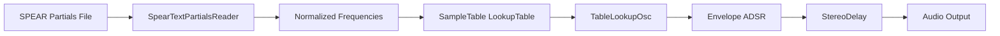

# Using the Application: MIDI, Sounds, and Controls

This section explains how the application generates **spectrum-based timbres** by importing spectral partials from SPEAR and driving them in real time via MIDI. You’ll learn how to parse partials, build custom wavetables, and wire up Tonic’s oscillators and envelopes.

## Spectrum and Partials-Based Sounds 🎵

Spectrum-based sounds derive their timbre from real-world recordings. The workflow:

- Export spectral partials (time, frequency, amplitude) from SPEAR.
- Parse the text file into arrays of **partialfrequencies** and **partialamplitudes**.
- Normalize frequencies to a reference pitch (e.g., C4 at 261.6 Hz).
- Sum sine components into a **SampleTable**.
- Playback via **TableLookupOsc**, modulated by MIDI note and envelope.

---

## SpearTextPartialsReader: Parsing SPEAR Partials

A helper class to read SPEAR’s `.txt` partials format into two vectors.

```cpp
// speartextpartialsreader.h
#ifndef SPEARTEXTPARTIALSREADER_H
#define SPEARTEXTPARTIALSREADER_H

#include <vector>
using namespace std;

class SpearTextPartialsReader {
public:
  vector<float> partialfrequencies;   // Averaged partial frequencies
  vector<float> partialamplitudes;    // Averaged partial amplitudes

  // Load and parse the SPEAR partials file
  SpearTextPartialsReader(const char* filename);
};

#endif
```

Key responsibilities:

- Open the text file.
- Tokenize lines into time, frequency, amplitude.
- Compute average frequency and amplitude per partial point.
- Populate `partialfrequencies` and `partialamplitudes`.

---

## Building a Custom Wavetable

Once partials are loaded, build a wavetable of length **tablesize** and fill it by summing sine waves at each partial’s normalized frequency.

```cpp
// Inside SimpleInstrumentTableLookupSPEARSynth constructor
// 1) Load partials and normalize to C4 (261.6 Hz)
SpearTextPartialsReader reader("HPchanter C4 Vel_1(partials).txt");
for (auto& f : reader.partialfrequencies) {
  f /= 261.6f;
}

// 2) Create and fill SampleTable
const unsigned int tablesize = 2500;                      // Arbitrary length
SampleTable lookupTable(tablesize, 1);                    // Mono table
TonicFloat norm = 1.0f / tablesize;
TonicFloat* tableData = lookupTable.dataPointer();

for (unsigned int i = 0; i < tablesize; ++i) {
  TonicFloat phase = TWO_PI * i * norm;
  TonicFloat sinesum = 0;
  for (size_t j = 0; j < reader.partialfrequencies.size(); ++j) {
    sinesum += reader.partialamplitudes[j]
             * sinf(phase * reader.partialfrequencies[j]);
  }
  *tableData++ = sinesum;   // Fill table entry
}
```

- **tablesize**: length of wavetable (will be resized to power-of-two+1 if needed)
- **lookupTable**: holds one period of the custom waveform
- **norm**: convert index to phase (0–2π)
- **tableData**: pointer to raw buffer

---

### Wavetable Parameters

| Variable | Description |
| --- | --- |
| tablesize | Number of samples in the wavetable |
| lookupTable | `SampleTable` instance storing waveform data |
| norm | Reciprocal of table size for phase calculation |
| tableData | Pointer to write wavetable samples |


---

## Integrating with Tonic Synth

Once the table is ready, define **ControlGenerators** to handle MIDI input and envelopes:

```cpp
// 2) MIDI note and velocity parameters
ControlGenerator midiNote         = addParameter("midiNote");
ControlGenerator midiNoteVelocity = addParameter("midiNoteVelocity");

// 3) Convert MIDI note to frequency
ControlGenerator noteFreq = ControlMidiToFreq().input(midiNote);

// 4) Envelope trigger
ControlGenerator envelopeTrigger = addParameter("trigger");
```

- **midiNote**: holds incoming MIDI note number
- **noteFreq**: frequency in Hz driving oscillators
- **envelopeTrigger**: gates ADSR envelopes

---

## Oscillator, Envelope, and Output

Create a **TableLookupOsc** that reads from the custom table, apply an ADSR envelope, and add optional delay:

```cpp
// 5) Create TableLookupOsc reading our wavetable
TableLookupOsc osc = TableLookupOsc()
  .setLookupTable(lookupTable)
  .freq(noteFreq);

// 6) Apply ADSR envelope
Generator oscWithEnvelope = osc
  * ADSR()
      .attack(0.01)
      .decay(1.5)
      .sustain(0)
      .release(0)
      .trigger(envelopeTrigger)
      .legato(true);

// 7) Optional stereo delay
Generator output = StereoDelay(1.5, 1.0)
  .input(oscWithEnvelope)
  .wetLevel(0.5)
  .feedback(0.7);

// 8) Set final output
setOutputGen(output);
```

This chain yields a timbre matching the analyzed instrument with real-time MIDI control.

---

## Real-Time MIDI Flowchart



This pipeline ensures each MIDI note triggers a realistically modeled timbre derived from real spectral data.