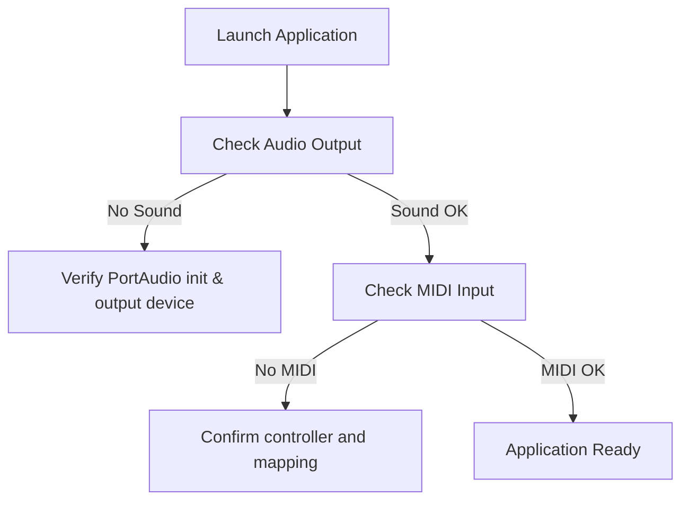

# Using the Application: MIDI, Sounds, and Controls – Troubleshooting Common Issues

When you launch the synth, you may encounter audio or MIDI problems. This guide walks you through the most common issues, how to identify them, and steps to fix them.

## Troubleshooting Flowchart

A quick overview of the decision process for sound and MIDI issues:



## Common Issue: No Sound Output

If you hear no audio, follow these checks:

- **PortAudio Initialization**

Ensure `Pa_Initialize()` returns `paNoError`.

```cpp
  mySPIAudioDevice.global_err = Pa_Initialize();
  if (mySPIAudioDevice.global_err != paNoError) {
      fprintf(pFILE, "portaudio initialization failed.\n");
      return 1;
  }
```

- **Output Device Selection**

Verify that a valid output device is selected (not `paNoDevice`):

```cpp
  if (global_outputParameters.device == paNoDevice) {
      // No valid output device found
      return false;
  }
```

- **Stream Opening and Starting**

Check error messages from `Pa_OpenStream` or `Pa_StartStream`:

```cpp
  err = Pa_OpenStream(&stream, NULL, &global_outputParameters,
                      SAMPLE_RATE, FRAMES_PER_BUFFER,
                      paClipOff, renderCallback, NULL);
  if (err != paNoError) {
      fprintf(pFILE, "Unable to open stream: %s\n", Pa_GetErrorText(err));
      return 1;
  }

  err = Pa_StartStream(stream);
  if (err != paNoError) {
      fprintf(pFILE, "Unable to start stream: %s\n", Pa_GetErrorText(err));
      return 1;
  }
```

### Checklist Table

| Symptom | What to Check | Action |
| --- | --- | --- |
| No error log | PortAudio initialized | Inspect console or `devices.txt` logging |
| Error on open | Output device selection (name match) | Adjust `global_audiooutputdevicename` |
| Silent stream | Callback not filling buffer | Verify `synth.fillBufferOfFloats` is called |


## Common Issue: No MIDI Input Detected

If the app reports **no MIDI ports available**, perform these steps:

- **PortMidi Initialization**

Confirm `Pm_Initialize()` is called without error.

```cpp
  Pm_Initialize();
```

- **Device Enumeration and Mapping**

The code builds a map of input devices and looks up your chosen name:

```cpp
  for (int i = 0; i < Pm_CountDevices(); i++) {
      const PmDeviceInfo* info = Pm_GetDeviceInfo(i);
      if (info->input) {
          global_inputmididevicemap[info->name] = i;
      }
  }
  auto it = global_inputmididevicemap.find(global_inputmididevicename);
  if (it == global_inputmididevicemap.end()) {
      StatusAddText(L"input midi device not found\n");
      return;
  }
```

- **Opening the MIDI Stream**

Check for errors from `Pm_OpenInput`:

```cpp
  err = Pm_OpenInput(&global_pPmStreamMIDIIN,
                     global_inputmidideviceid,
                     NULL, 512, NULL, NULL);
  if (err) {
      StatusAddTextA(Pm_GetErrorText(err));
      return;
  }
```

### MIDI Checklist

- Controller plugged in and powered.
- OS recognizes the device (check Device Manager on Windows).
- `global_inputmididevicename` matches an entry in the printed device list.
- `global_inputmidichannel` set to the correct channel (default 0 for all channels).

## Command-Line Overrides for Devices

You can override audio and MIDI device names via command-line arguments:

| Arg Index | Parameter | Example |
| --- | --- | --- |
| 1 | MIDI device name | `"Q49"` |
| 3 | Audio output device name | `"E-MU ASIO"` |
| 4, 5 | ASIO channel selectors (left/right) | `0 1` |


```cpp
if (nArgs > 1) global_inputmididevicename = argv[1];
if (nArgs > 3) mySPIAudioDevice.global_audiooutputdevicename = argv[3];
if (nArgs > 4) global_outputAudioChannelSelectors[0] = atoi(argv[4]);
if (nArgs > 5) global_outputAudioChannelSelectors[1] = atoi(argv[5]);
```

## ASIO Interfaces and Drivers ⚠️

The application uses ASIO-specific stream info for low-latency audio. If your device host API is **paASIO**:

- **Ensure ASIO drivers are installed**
- The code populates `PaAsioStreamInfo` when `hostApiType == paASIO`.

```cpp
if (hostApiType == paASIO) {
    global_outputParameters.hostApiSpecificStreamInfo = &global_asioOutputInfo;
}
```

If ASIO drivers are missing, PortAudio may fall back to another API or report `paNoDevice`.

```card
{
    "title": "ASIO Reminder",
    "content": "Install ASIO drivers if using ASIO devices to avoid stream errors."
}
```

## Enabling Verbose Device Logging

You can generate a **devices.txt** log to inspect what names are detected:

```cpp
pFILE = fopen("devices.txt", "w");
mySPIAudioDevice.m_pFILE = pFILE;
mySPIAudioDevice.SelectAudioOutputDevice();
fclose(mySPIAudioDevice.m_pFILE);
```

Set `global_textdisplay = 1` to print device lists to the GUI console.

## Best Practices

- **Match names exactly**: Audio and MIDI device names often include host API prefixes.
- **Test with defaults**: If in doubt, remove overrides so defaults (`Pa_GetDefault*Device`) are used.
- **Verify with external tools**: Use **Windows Sound Settings** and **MIDI-OX** (or equivalent) to confirm device availability.

By following these steps, you should resolve most audio- and MIDI-related issues when using the synth application.