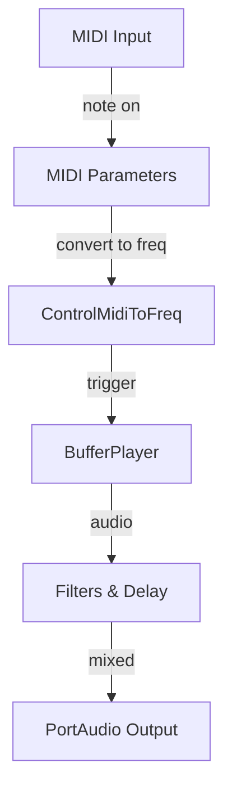

# Using the Application: MIDI, Sounds, and Controls

## Working with External Audio Samples

This section explains how several synth voices incorporate external audio samples. We cover loading files with **libsndfile**, buffering with **Tonic’s SampleTable**, and playback via **BufferPlayer**. You’ll learn how to trigger samples from MIDI events and shape them with filters, envelopes, and delays to build hybrid instruments.

---

## Core Components

Below are the primary classes and their responsibilities when working with external samples:

| Class | Purpose |
| --- | --- |
| **SndfileHandle** | Open and read WAV/AIFF/etc. files using **libsndfile** |
| **SampleTable** | Store raw sample frames and channels in a contiguous memory buffer |
| **BufferPlayer** | Play back sample data with looping and trigger control |


---

## 1. Loading Samples with SndfileHandle 🎵

Use **SndfileHandle** to open an audio file and verify its format:

```cpp
#include <sndfile.hh>

// 1) Open the file
SndfileHandle file("path/to/sample.wav");

// 2) Validate format
assert(file.samplerate() == 44100);
assert(file.channels()   == 2);
```

• **SndfileHandle** reads header metadata (sample rate, channels, frames) before streaming samples.

---

## 2. Storing Audio in SampleTable

Once opened, allocate a **SampleTable** matching the file’s frames and channels, then read into it:

```cpp
// Create a buffer of [frames × channels]
SampleTable buffer(file.frames(), file.channels());

// Read interleaved samples into the table
file.read(buffer.dataPointer(),
          file.frames() * file.channels());
```

• **SampleTable** holds audio in float-precision form for use by Tonic generators.

---

## 3. Playing Back Samples with BufferPlayer

Configure a **BufferPlayer** to use the filled SampleTable:

```cpp
// Instantiate and assign buffer
BufferPlayer player;
player.setBuffer(buffer)
      .loop(false);   // disable looping
```

- **setBuffer(...)** links the SampleTable
- **loop(true/false)** determines repeat behavior

---

## 4. Synth Voice Integration

Combine sample playback with control generators to respond to MIDI or timed triggers. Below is an excerpt from a polyphonic voice factory (`createSynthVoice_v4`) that loads a “Highland Pipes” sample, checks format, and sets up the BufferPlayer to trigger on a pulse generator:

```cpp
Synth createSynthVoice_v4(){
  Synth newSynth;
  // … parameter setup …

  // Load external sample
  SndfileHandle file1("…/HPdrones.wav");
  assert(file1.samplerate() == 44100);
  assert(file1.channels()   == 2);

  SampleTable buffer1(file1.frames(), file1.channels());
  file1.read(buffer1.dataPointer(),
             file1.frames() * file1.channels());

  // Configure BufferPlayer
  BufferPlayer bPlayer1;
  bPlayer1.setBuffer(buffer1)
          .loop(false);

  // Trigger sample on a random pulse
  ControlGenerator noiseTrigger =
    ControlMetro()
      .bpm(ControlRandom().min(50).max(200))
      .trigger(resetTrigger);

  Generator tone =
    bPlayer1.trigger(noiseTrigger);

  newSynth.setOutputGen(tone);
  return newSynth;
}
```

This voice is registered into the polyphonic engine based on user selection:

```cpp
poly.addVoices(createSynthVoice_v4, 8);  // events bufferplayer synth 
```

---

## 5. MIDI-Driven Triggering

To respond directly to MIDI note-on and velocity:

1. **Define MIDI parameters** on the Synth:

```cpp
   ControlGenerator midiNote =
     addParameter("midiNote");
   ControlGenerator velocity =
     addParameter("midiNoteVelocity");
```

1. **Convert note to frequency**:

```cpp
   ControlGenerator noteFreq =
     ControlMidiToFreq().input(midiNote);
```

1. **Create an envelope trigger**:

```cpp
   ControlGenerator trigger =
     addParameter("trigger");
```

1. **Play sample on trigger**:

```cpp
   Generator tone =
     bPlayer1.trigger(trigger);
   setOutputGen(tone);
```

This binds sample playback to incoming MIDI events, enabling real-time performance control.

---

## 6. Layering Effects 🎚️

After playback, you can shape the sample further:

- **Envelopes**: ADSR decay/gate for dynamic control
- **Filters**: LPF/BPF to sculpt tone
- **Delays**: StereoDelay for spatial effects

```cpp
// Example: band-pass filtered sample
Generator sampleOut =
  bPlayer1.trigger(trigger);

Generator filtered =
  sampleOut >> BPF24()
    .cutoff(noteFreq)
    .Q(5.0);

setOutputGen(filtered);
```

Combining BufferPlayer with standard Tonic generators yields rich hybrid instruments.

---

## 7. Sample Playback Flow



---

```card
{
    "title": "Tip",
    "content": "Always verify file samplerate and channels with assert to prevent runtime errors."
}
```

---

By following these steps and patterns, you can integrate any external audio sample into the polyphonic synthesizer, layering sampled material with synthesized elements for versatile, expressive instruments.